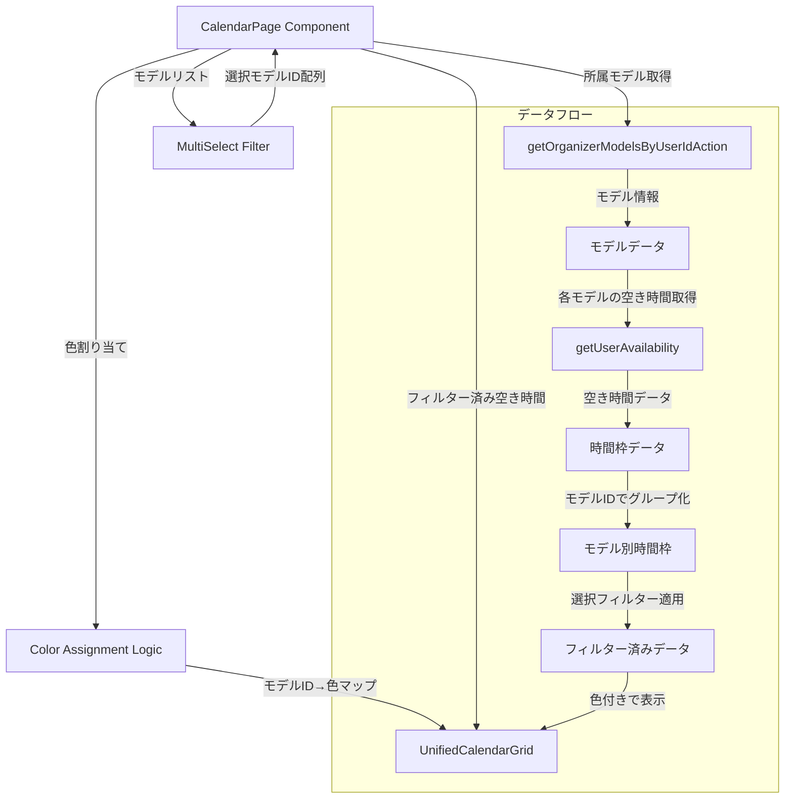

# カレンダーページ：所属モデル空き時間フィルター実装

## 実装概要

運営者がカレンダーページで所属モデルの空き時間を個別に表示/非表示できるフィルター機能を実装します。各モデルには自動的に異なる色を割り当て、視覚的に区別できるようにします。

## アーキテクチャ



## 実装ステップ

### 1. 色割り当てロジックの実装

**ファイル**: [`src/app/[locale]/calendar/page.tsx`](src/app/[locale]/calendar/page.tsx)

定義済みの色パレットから各モデルに自動的に色を割り当てる関数を追加：

```typescript
// カラーパレット定義（モデルごとに異なる色）- 16色に拡張
const MODEL_COLORS = [
  "#a855f7", // 紫
  "#f97316", // オレンジ
  "#ec4899", // ピンク
  "#06b6d4", // シアン
  "#84cc16", // ライム
  "#f59e0b", // アンバー
  "#8b5cf6", // バイオレット
  "#14b8a6", // ティール
  "#ef4444", // レッド
  "#3b82f6", // ブルー
  "#10b981", // エメラルド
  "#f43f5e", // ローズ
  "#6366f1", // インディゴ
  "#eab308", // イエロー
  "#d946ef", // フクシア
  "#0ea5e9", // スカイ
];

// モデルIDに基づいて色を割り当てる関数
const getModelColor = (
  modelId: string,
  allModels: OrganizerModelWithProfile[]
): string => {
  const index = allModels.findIndex((m) => m.model_id === modelId);
  return MODEL_COLORS[index % MODEL_COLORS.length];
};
```

### 2. 状態管理の追加

**ファイル**: [`src/app/[locale]/calendar/page.tsx`](src/app/[locale]/calendar/page.tsx)

モデルフィルター用の状態を追加：

```typescript
// 既存の状態に追加
const [organizerModels, setOrganizerModels] = useState<
  OrganizerModelWithProfile[]
>([]);
const [selectedModelIds, setSelectedModelIds] = useState<string[]>([]);
const [modelAvailabilityMap, setModelAvailabilityMap] = useState<{
  [modelId: string]: { [day: number]: string };
}>({});
```

### 3. 所属モデルデータ取得の修正

**ファイル**: [`src/app/[locale]/calendar/page.tsx`](src/app/[locale]/calendar/page.tsx)

現在の実装（614-702 行目）を修正し、モデル別にデータを管理：

```typescript
// 運営者の場合、所属モデルのスケジュールを取得
if (profile.user_type === "organizer") {
  const loadModelData = async () => {
    try {
      const modelsRes = await getOrganizerModelsByUserIdAction(user.id);

      if (modelsRes.success && modelsRes.data && modelsRes.data.length > 0) {
        setOrganizerModels(modelsRes.data);

        // 初期状態：全モデルを選択
        if (selectedModelIds.length === 0) {
          setSelectedModelIds(modelsRes.data.map((m) => m.model_id));
        }

        const monthStart = new Date(displayYear, displayMonth, 1);
        const monthEnd = new Date(displayYear, displayMonth + 1, 0);
        const supabase = await (
          await import("@/lib/supabase/client")
        ).createClient();

        // モデルごとに空き時間を取得し、個別に管理
        const modelAvailabilityData: typeof modelAvailabilityMap = {};

        for (const model of modelsRes.data) {
          const { data: slots } = await supabase
            .from("user_availability")
            .select("available_date, start_time_minutes, end_time_minutes")
            .eq("user_id", model.model_id)
            .eq("is_active", true)
            .gte("available_date", monthStart.toISOString().split("T")[0])
            .lte("available_date", monthEnd.toISOString().split("T")[0]);

          const labels: { [day: number]: string } = {};
          (slots || []).forEach((s) => {
            const d = new Date(s.available_date);
            const day = d.getDate();
            const start = `${String(
              Math.floor(s.start_time_minutes / 60)
            ).padStart(2, "0")}:${String(s.start_time_minutes % 60).padStart(
              2,
              "0"
            )}`;
            const end = `${String(Math.floor(s.end_time_minutes / 60)).padStart(
              2,
              "0"
            )}:${String(s.end_time_minutes % 60).padStart(2, "0")}`;
            const range = `${start}-${end}`;
            const prev = labels[day];
            labels[day] = prev ? `${prev}, ${range}` : range;
          });

          modelAvailabilityData[model.model_id] = labels;
        }

        setModelAvailabilityMap(modelAvailabilityData);
      }
    } catch {
      setOrganizerModels([]);
      setModelAvailabilityMap({});
    }
  };

  loadModelData();
}
```

### 4. UnifiedCalendarGrid の修正

**ファイル**: [`src/app/[locale]/calendar/page.tsx`](src/app/[locale]/calendar/page.tsx)

カレンダーグリッドのインターフェースとロジックを修正：

```typescript
// インターフェース修正（76-85行目付近）
interface UnifiedCalendarGridProps {
  userFeatures: Feature[];
  photoSessionFeatures: Feature[];
  onDateClick: (date: Date) => void;
  organizerLabelsByDay?: { [day: number]: string };
  modelAvailabilityMap?: { [modelId: string]: { [day: number]: string } };
  selectedModelIds?: string[];
  organizerModels?: OrganizerModelWithProfile[];
  showUserSchedule: boolean;
  showOrganizerSchedule: boolean;
  showModelSchedule: boolean;
  showPhotoSessions: boolean;
  onPhotoSessionClick: (featureId: string) => void;
}

// カレンダーグリッド内の表示ロジック修正（223-257行目付近）
{
  /* 所属モデルスケジュール - モデルごとに色分けして表示 */
}
{
  showModelSchedule &&
    selectedModelIds &&
    organizerModels &&
    selectedModelIds.map((modelId) => {
      const modelData = organizerModels.find((m) => m.model_id === modelId);
      const availability = modelAvailabilityMap?.[modelId]?.[day];

      if (!availability || !modelData) return null;

      const modelColor = getModelColor(modelId, organizerModels);
      const modelName = modelData.model_profile?.display_name || "モデル";

      return (
        <div
          key={`model-${modelId}-${day}`}
          className="relative text-xs px-0.5 py-0.5 rounded truncate"
          style={{ backgroundColor: modelColor + "20" }}
        >
          <div
            className="absolute left-0 top-0 bottom-0 w-0.5 rounded-full"
            style={{ backgroundColor: modelColor }}
          />
          <span className="ml-1 text-[10px] lg:text-xs truncate block">
            {modelName}: {availability}
          </span>
        </div>
      );
    });
}
```

### 5. MultiSelect フィルターの追加

**ファイル**: [`src/app/[locale]/calendar/page.tsx`](src/app/[locale]/calendar/page.tsx)

インポートを追加（1-57 行目付近）：

```typescript
import { MultiSelect } from "@/components/ui/multi-select";
```

フィルター UI を凡例エリアに追加（781-843 行目付近）：

```typescript
{
  /* 凡例・フィルタ */
}
<div className="mt-4 space-y-4">
  {/* 運営者の場合：モデルフィルター */}
  {profile.user_type === "organizer" && organizerModels.length > 0 && (
    <div className="p-3 rounded-lg bg-muted/30">
      <Label className="text-sm font-medium mb-2 block">
        表示するモデルを選択
      </Label>
      <MultiSelect
        options={organizerModels.map((model) => ({
          label: model.model_profile?.display_name || "モデル",
          value: model.model_id,
        }))}
        onValueChange={setSelectedModelIds}
        defaultValue={selectedModelIds}
        placeholder="モデルを選択..."
        className="w-full"
      />

      {/* 色凡例 */}
      <div className="mt-3 flex flex-wrap gap-2">
        {organizerModels
          .filter((m) => selectedModelIds.includes(m.model_id))
          .map((model) => (
            <div key={model.model_id} className="flex items-center gap-2">
              <div
                className="h-3 w-3 rounded-full flex-shrink-0"
                style={{
                  backgroundColor: getModelColor(
                    model.model_id,
                    organizerModels
                  ),
                }}
              />
              <span className="text-xs">
                {model.model_profile?.display_name || "モデル"}
              </span>
            </div>
          ))}
      </div>
    </div>
  )}

  {/* 既存のチェックボックスフィルター */}
  <div className="flex flex-wrap justify-center gap-4 p-3 rounded-lg bg-muted/30">
    {/* 既存のフィルター項目 */}
  </div>
</div>;
```

### 6. 型定義の追加

**ファイル**: [`src/types/organizer-model.ts`](src/types/organizer-model.ts)

既存の型を確認し、必要に応じてインポート：

```typescript
import type { OrganizerModelWithProfile } from "@/types/organizer-model";
```

## 実装の特徴

1. **自動色割り当て**: 16 色のパレットから循環的に色を割り当て
2. **名前入力フィルター**: MultiSelect コンポーネントの標準機能（CommandInput）を利用
3. **すべて選択/解除**: MultiSelect コンポーネントの標準機能（toggleAll、handleClear）を利用
4. **モデル名表示**: カレンダー上の時間枠にモデル名を含めて表示
5. **色凡例**: 選択中のモデルと対応する色を凡例エリアに表示
6. **パフォーマンス**: モデルごとにデータを個別管理し、フィルター時の再計算を最小化

## テスト確認項目

- [ ] 運営者アカウントでカレンダーページにアクセス
- [ ] モデルフィルターが表示される
- [ ] 各モデルの空き時間が異なる色で表示される
- [ ] 名前入力で絞り込みができる
- [ ] 「全て選択」で全モデルが選択される
- [ ] 個別のモデルの選択/解除ができる
- [ ] 「クリア」で全モデルが解除される
- [ ] 色凡例が正しく表示される
- [ ] カレンダー上でモデル名と時間が表示される