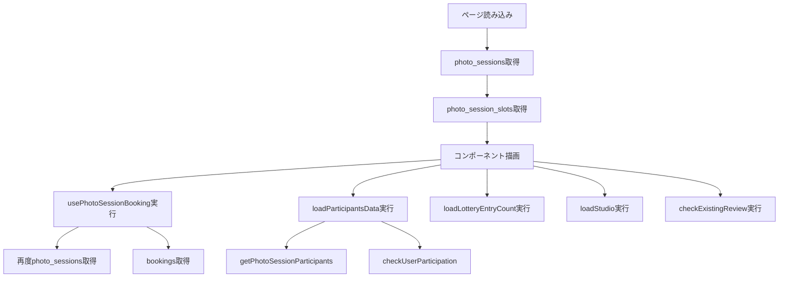

# 撮影会詳細ページのパフォーマンス最適化計画

## 問題の特定

現在、撮影会詳細ページ (`/photo-sessions/[id]`) では以下の問題が発生しています：

### 🔴 重大な問題

#### 1. データの重複取得

- **セッション情報**: サーバーサイドとクライアントサイド（`usePhotoSessionBooking`）で 2 回取得
- **ユーザー参加状態**: `loadParticipantsData`内の`checkUserParticipation`と`usePhotoSessionBooking`内の既存予約チェックが重複

#### 2. 直列実行による遅延

現在のデータフェッチフロー：



すべてのクエリが順次実行されており、合計で**約 10 個以上のデータベースクエリ**が発生しています。

### 🟡 その他の問題

- 条件によっては不要なデータも取得している（抽選情報、スタジオ情報など）
- リアルタイム購読が複数チャンネルで発生

---

## 最適化計画

### Phase 1: サーバーサイドでの並列データ取得【最重要】

**ファイル**: [`src/app/[locale]/photo-sessions/[id]/page.tsx`](src/app/[locale]/photo-sessions/[id]/page.tsx)**現状の問題**:

```typescript
// 直列実行
const { data: session } = await supabase.from('photo_sessions')...
const { data: slots } = await supabase.from('photo_session_slots')...
```

**改善策**:

```typescript
// 並列実行に変更
const [sessionResult, slotsResult, userBookingResult, studioResult] =
  await Promise.all([
    supabase.from("photo_sessions").select("...").eq("id", id).single(),
    supabase.from("photo_session_slots").select("*").eq("photo_session_id", id),
    user
      ? supabase
          .from("bookings")
          .select("*")
          .eq("photo_session_id", id)
          .eq("user_id", user.id)
      : null,
    supabase
      .from("organizer_studios")
      .select("studio:studios(id, name)")
      .eq("photo_session_id", id)
      .maybeSingle(),
  ]);
```

**効果**: 初期データ取得時間を**50-70%削減**---

### Phase 2: クライアントサイドの useEffect 統合【重要】

**ファイル**: [`src/components/photo-sessions/PhotoSessionDetail.tsx`](src/components/photo-sessions/PhotoSessionDetail.tsx)**現状の問題**: 複数の useEffect が個別に実行され、それぞれが API コールを行っている**改善策**: 単一の useEffect で並列データフェッチ

```typescript
useEffect(() => {
  const loadAllData = async () => {
    if (!user) return;

    setIsLoadingData(true);

    try {
      // 条件付き並列実行
      const promises = [
        getPhotoSessionParticipants(session.id),
        // checkUserParticipation は不要（participantsデータから判定可能）
      ];

      // 抽選方式の場合のみエントリー数取得
      if (session.booking_type === "lottery") {
        promises.push(getLotterySession(session.id));
      }

      // スタジオ情報が未取得の場合のみ
      if (!studioFromServer) {
        promises.push(getPhotoSessionStudioAction(session.id));
      }

      // レビュー権限がある場合のみ
      if (canReview) {
        promises.push(checkExistingReview());
      }

      const results = await Promise.all(promises);
      // 結果を適切に処理
    } finally {
      setIsLoadingData(false);
    }
  };

  loadAllData();
}, [session.id, user?.id, session.booking_type, canReview]);
```

**効果**: クライアントサイドのデータ取得時間を**40-60%削減**---

### Phase 3: usePhotoSessionBooking フックの最適化【重要】

**ファイル**: [`src/hooks/usePhotoSessionBooking.ts`](src/hooks/usePhotoSessionBooking.ts)**現状の問題**:

- `photo_sessions`を再取得している（親コンポーネントで既に取得済み）
- `bookings`を個別に取得している

**改善策 1**: サーバーサイドから渡されたデータを活用

```typescript
export function usePhotoSessionBooking(
  session: PhotoSessionWithOrganizer,
  userBooking: UserBooking | null // 新規パラメータ
) {
  // photo_sessionsの再取得を削除
  // bookingsの取得を削除（userBookingパラメータを使用）
  // 予約可能状態の判定ロジックのみ実行
}
```

**改善策 2**: リアルタイム購読の最適化

- 必要な場合のみ購読を開始
- チャンネルを 1 つに統合

**効果**: 不要なクエリを**2 つ削減**、リアルタイム購読オーバーヘッドを**50%削減**---

### Phase 4: 条件付きデータフェッチ【中優先度】

以下のデータは条件付きでのみ取得：

1. **抽選エントリー数**: `session.booking_type === 'lottery'` の場合のみ
2. **スタジオ情報**: サーバーサイドで取得できなかった場合のみ
3. **既存レビュー**: `canReview === true` の場合のみ

**実装**: 上記 Phase 2 の改善策に含まれる---

### Phase 5: 重複クエリの削除【重要】

1. **checkUserParticipation の削除**

- `getPhotoSessionParticipants`の結果から判定可能
  ```typescript
  const isParticipant = participants.some((p) => p.user_id === user?.id);
  ```


2. **usePhotoSessionBooking 内の bookings クエリ削除**

- サーバーサイドで取得したデータを活用

---

## 期待される効果

### パフォーマンス改善

| 指標 | 現状 | 改善後 | 削減率 |

|------|------|--------|--------|

| 初期データ取得 | ~3-5 秒 | ~1-1.5 秒 | **60-70%** |

| データベースクエリ数 | 10-12 回 | 4-6 回 | **50-60%** |

| クライアントサイド API 呼び出し | 5-7 回 | 2-3 回 | **60-70%** |

| 重複クエリ | 4 回 | 0 回 | **100%** |

### ユーザー体験

- ページ表示までの体感速度が大幅に向上
- ローディング状態の改善
- ネットワーク帯域の削減

---

## 実装順序

1. **Phase 1**: サーバーサイド並列化（最も効果が大きい）
2. **Phase 3**: usePhotoSessionBooking の最適化（重複削除）
3. **Phase 2**: クライアントサイド useEffect 統合
4. **Phase 4**: 条件付きフェッチ
5. **Phase 5**: 残りの重複クエリ削除

---

## 実装時の注意事項

### 互換性の維持

- 既存の機能を壊さないよう、段階的に実装
- 各 Phase 完了後に動作確認を実施

### エラーハンドリング

- Promise.all でのエラーハンドリングを適切に実装
- 一部のクエリが失敗しても他のデータは表示できるようにする

### 型安全性

- サーバーサイドで取得したデータの型定義を追加
- クライアントコンポーネントへの props 型を更新

---

## テスト計画

各 Phase 完了後に以下をテスト：

1. **機能テスト**

- 開催者・参加者・未参加者での表示
- 抽選方式・先着順での動作
- スロット制・通常撮影会での動作

2. **パフォーマンステスト**

- Chrome DevTools でネットワークタブを確認
- データベースクエリ数をログで確認
- 読み込み時間を計測

3. **エッジケース**

- ネットワークエラー時の挙動
- データが存在しない場合の処理