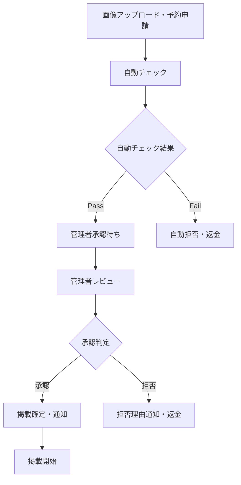

# 画像ハイジャック広告システム 要件定義書

## 📋 概要

ShutterHubのトップページやログインページなどの主要エリアに、ユーザーが課金して自分の画像を掲載できる広告システム。美容院予約のような時間枠管理システムとして実装し、承認プロセスを組み込んだ運用を行う。

## 🎯 基本仕様

### システム名称
- **正式名称**: ShutterHub 広告掲載システム
- **内部名称**: Advertisement Hijack System
- **ユーザー向け名称**: 「プレミアム掲載」「スポット広告」

### 基本コンセプト
- **時間枠予約制**: 美容院予約のような時間単位での枠予約
- **事前承認制**: 掲載開始1日前までの承認プロセス
- **プレミアム機能**: 高額課金による特別な露出機会

## 💰 課金・料金システム

### 料金体系
```yaml
基本料金設定:
  1分単位: 100円/分（基準価格）
  1時間パック: 5,000円（約17%割引）
  6時間パック: 25,000円（約31%割引）
  24時間パック: 80,000円（約44%割引）

動的価格設定:
  - 管理画面から料金変更可能
  - 時間帯別料金設定可能（ピーク・オフピーク）
  - 広告枠別料金設定可能
  - 季節・イベント連動価格設定可能
```

### 課金方式
- **前払い制**: 予約時に全額決済
- **自動延長**: オプションで自動延長可能
- **返金ポリシー**: 承認拒否時は全額返金、ユーザー都合キャンセルは50%返金

### 手数料
- **プラットフォーム手数料**: 売上の10%
- **決済手数料**: Stripe手数料（約3.6%）

## 📍 表示場所・広告枠

### Phase 1 対象エリア
```yaml
トップページ:
  - メインビジュアル下バナー: 1200x300px
  - サイドバー大: 300x600px

ログインページ:
  - 背景画像オーバーレイ: 1920x1080px（透過度調整）
  - サイドパネル: 400x800px

共通エリア:
  - ヘッダー下バナー: 1200x200px（全ページ共通）
```

### Phase 2 拡張予定
- 撮影会詳細ページ
- 検索結果ページ
- プロフィールページ
- モバイル専用枠

## ⏰ 予約・承認システム

### 予約制限ルール
```yaml
予約可能期間:
  最短予約: 掲載開始24時間前まで
  最長予約: 掲載開始180日前まで
  
時間単位:
  最小単位: 15分
  最大連続: 7日間
  
予約締切:
  平日: 掲載開始24時間前の17:00まで
  休日前: 掲載開始48時間前の17:00まで
```

### 承認プロセス


### 承認タイムライン
- **申請受付**: 24時間365日
- **承認作業時間**: 平日9:00-18:00
- **承認所要時間**: 最大24時間以内
- **緊急対応**: 土日祝日は緊急時のみ

## 🖼️ 画像・コンテンツ要件

### 技術仕様
```yaml
ファイル形式:
  許可: JPG, PNG, WebP
  禁止: GIF, MP4, SVG

ファイルサイズ:
  最大: 10MB
  推奨: 2MB以下

画像サイズ:
  枠別に固定サイズ
  自動リサイズ: あり
  アスペクト比: 枠に合わせて調整

画質:
  アップロード時: 元画質保持
  配信時: WebP変換・最適化
```

### コンテンツガイドライン
#### 禁止コンテンツ
- アダルト・性的表現
- 暴力・グロテスクな内容
- 差別・ヘイト表現
- 著作権侵害の疑い
- 競合他社の直接的な宣伝
- 政治的・宗教的メッセージ
- 個人の顔写真（許可なし）
- 薬機法・景品表示法違反の疑い

#### 要注意コンテンツ（個別判断）
- 商業的色彩の強い内容
- ShutterHubと関連性の低い内容
- 過度に派手・目立つデザイン
- テキスト量の多い画像

## 👤 利用対象・権限

### 利用可能ユーザー
```yaml
Phase 1:
  - 本人確認済みユーザー
  - アカウント開設から30日経過
  - 過去に違反履歴なし

Phase 2:
  - ユーザーランク: シルバー以上
  - 撮影会参加実績: 3回以上
  - 評価平均: 4.0以上

特別枠:
  - VIPユーザー: 事前承認不要
  - パートナー企業: 専用料金・枠
```

### 利用制限
- **同時予約数**: 1ユーザー最大3枠まで
- **月間利用限度**: 50万円まで
- **連続掲載制限**: 同一枠で最大7日間

## 🛡️ セキュリティ・不正対策

### 自動チェック機能
```yaml
画像解析:
  - Google Cloud Vision API
  - 不適切コンテンツ検出
  - テキスト抽出・NGワード検出
  - 類似画像検索（著作権チェック）

行動分析:
  - 短時間での大量申請検出
  - 異常な料金設定の検出
  - 同一画像の重複申請検出
```

### 手動チェック項目
- 画像内容の適切性
- ShutterHubブランドとの整合性
- 法的問題の有無
- ユーザーの過去実績確認

### 違反時の対応
```yaml
軽微な違反:
  - 警告メール送信
  - 該当広告の削除
  - 返金（50%）

重大な違反:
  - アカウント一時停止（7-30日）
  - 返金なし
  - 再申請禁止期間設定

悪質な違反:
  - アカウント永久停止
  - 法的措置の検討
  - 関連アカウントの調査
```

## 📊 管理・運用機能

### 管理者機能
```yaml
承認管理:
  - 申請一覧・詳細確認
  - 承認・拒否処理
  - 拒否理由テンプレート
  - 緊急削除機能

料金管理:
  - 動的料金設定
  - 割引キャンペーン設定
  - 売上レポート
  - 返金処理

ユーザー管理:
  - 利用履歴確認
  - 違反履歴管理
  - ブラックリスト管理
  - 特別権限付与
```

### ユーザー機能
```yaml
予約管理:
  - カレンダー形式での枠選択
  - リアルタイム空き状況確認
  - 予約履歴・ステータス確認
  - キャンセル・変更申請

画像管理:
  - 画像アップロード・プレビュー
  - 過去使用画像の再利用
  - 画像ライブラリ管理

統計確認:
  - 表示回数・クリック数
  - 効果測定データ
  - ROI計算支援
```

## 🔄 段階的実装計画

### Phase 1: 基本システム（3-4週間）
- [ ] 1つの広告枠（トップページメインバナー）
- [ ] 基本的な予約・課金システム
- [ ] 手動承認フロー
- [ ] 基本的な管理画面

### Phase 2: 機能拡張（4-6週間）
- [ ] 複数広告枠の追加
- [ ] 自動チェック機能の導入
- [ ] 統計・分析機能
- [ ] ユーザーランク連携

### Phase 3: 高度化（6-8週間）
- [ ] AI活用の自動承認
- [ ] 動的価格設定
- [ ] A/Bテスト機能
- [ ] API提供

## ⚠️ リスク・懸念事項

### 運用リスク
- **承認作業負荷**: 日次10-50件の承認作業
- **24時間対応**: 緊急削除要請への対応
- **判断基準**: 複数管理者間での一貫性確保

### 法的リスク
- **著作権侵害**: 申請者責任の明確化
- **景品表示法**: 過大な宣伝表現の規制
- **プラットフォーム責任**: 掲載内容への責任範囲

### 技術リスク
- **表示切り替え**: 時間ぴったりの切り替え精度
- **高負荷対応**: ピーク時間のアクセス集中
- **キャッシュ管理**: CDN・ブラウザキャッシュとの整合性

### ビジネスリスク
- **ブランドイメージ**: 不適切広告による評判悪化
- **ユーザー体験**: 過度な広告によるUX低下
- **収益性**: 運用コストと売上のバランス

## 📈 成功指標・KPI

### 利用指標
- **月間申請数**: 100件（Phase 1目標）
- **承認率**: 80%以上
- **リピート率**: 60%以上
- **平均利用金額**: 15,000円/件

### 運用指標
- **承認所要時間**: 平均12時間以内
- **違反率**: 5%以下
- **ユーザー満足度**: 4.0/5.0以上

### 収益指標
- **月間売上**: 150万円（Phase 1目標）
- **運用コスト回収率**: 200%以上
- **プラットフォーム手数料率**: 10%維持

## 📝 今後の検討事項

### 短期（3ヶ月以内）
- [ ] 法的確認（弁護士相談）
- [ ] 競合他社調査
- [ ] ユーザーニーズ調査
- [ ] 技術的実現可能性確認

### 中期（6ヶ月以内）
- [ ] AI自動承認の精度向上
- [ ] 海外展開の可能性
- [ ] 動画広告への対応
- [ ] パートナーシップ拡大

### 長期（1年以内）
- [ ] 独立した広告プラットフォーム化
- [ ] 他サイトへのシステム提供
- [ ] 広告効果測定の高度化
- [ ] ブロックチェーン技術の活用

---

**文書作成日**: 2025年1月18日  
**最終更新日**: 2025年1月18日  
**作成者**: ShutterHub開発チーム  
**承認者**: （未定）
