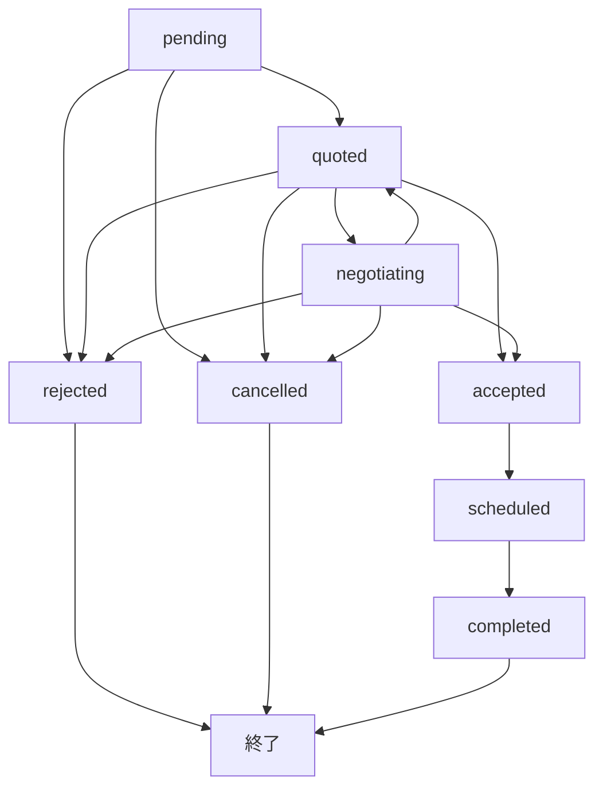

# カメラマンリクエスト撮影システム 詳細要件定義書

> **作成日**: 2025-01-27  
> **対象システム**: ShutterHub v2  
> **機能名**: カメラマン→運営リクエスト撮影システム

## 📋 **システム概要**

### 🎯 **目的**
カメラマンが運営に対して「特定モデル × 撮影内容 × 日時」を指定したリクエスト撮影を提案し、運営が詳細見積もりを返すプロセスをシステム化する。従来のメールベース業務をWebシステムで効率化。

### 🎪 **対象ユーザー**
- **リクエスト送信者**: カメラマン（モデル兼カメラマン含む）
- **リクエスト受信者**: 撮影会運営者
- **対象モデル**: 運営所属モデル + フリーランスモデル

### 🔄 **基本フロー**
```
1. カメラマンがリクエスト作成 
   ↓
2. 運営が詳細見積もり作成・送信
   ↓  
3. グループチャットで相談・調整
   ↓
4. 承認後、正式な撮影会として確定
   ↓
5. 撮影実施・写真納品
```

---

## 📊 **データベース設計**

### **1. リクエスト撮影メインテーブル**

```sql
CREATE TABLE photo_session_requests (
  id UUID PRIMARY KEY DEFAULT gen_random_uuid(),
  requester_id UUID REFERENCES profiles(id) NOT NULL, -- カメラマン
  organizer_id UUID REFERENCES profiles(id) NOT NULL, -- 運営者
  target_model_id UUID REFERENCES profiles(id) NOT NULL, -- 指定モデル
  
  -- 基本情報
  title TEXT NOT NULL,
  description TEXT,
  preferred_date DATE NOT NULL,
  preferred_start_time_minutes INTEGER NOT NULL, -- 分単位: 360=6:00AM, 480=8:00AM
  preferred_end_time_minutes INTEGER NOT NULL,   -- 分単位: 720=12:00PM, 1080=6:00PM
  duration_hours DECIMAL(3,1) NOT NULL, -- 計算用: 5.0時間など
  
  -- 場所情報
  location_preference TEXT, -- 「季の風」「スタジオXYZ」
  location_address TEXT,
  location_map_url TEXT, -- Googleマップリンク
  gathering_point_details TEXT, -- 集合場所詳細
  gathering_point_map_url TEXT, -- 集合場所マップリンク
  
  -- 撮影内容
  outfit_requirements TEXT DEFAULT 'モデルさんにお任せ（私服）',
  special_requests TEXT,
  shooting_style TEXT, -- 'portrait', 'fashion', 'cosplay', 'commercial'
  
  -- フリーランスモデル対応
  is_freelance_model BOOLEAN DEFAULT false,
  freelance_model_contact TEXT, -- フリーランスモデルの連絡先
  
  -- ステータス管理
  status TEXT DEFAULT 'pending' CHECK (
    status IN (
      'pending',        -- 運営確認待ち
      'quoted',         -- 見積もり提示済み
      'negotiating',    -- 相談・調整中
      'accepted',       -- 承認済み
      'scheduled',      -- 撮影会として確定
      'completed',      -- 撮影完了
      'rejected',       -- 運営による拒否
      'cancelled'       -- キャンセル
    )
  ),
  
  -- メタ情報
  created_at TIMESTAMP WITH TIME ZONE DEFAULT NOW(),
  updated_at TIMESTAMP WITH TIME ZONE DEFAULT NOW(),
  
  -- 制約
  CONSTRAINT valid_time_range CHECK (preferred_start_time_minutes < preferred_end_time_minutes),
  CONSTRAINT valid_time_bounds CHECK (
    preferred_start_time_minutes >= 0 AND preferred_start_time_minutes < 1440 AND
    preferred_end_time_minutes > 0 AND preferred_end_time_minutes <= 1440
  )
);
```

### **2. エクセル風見積もりテーブル**

```sql
CREATE TABLE photo_session_quotes (
  id UUID PRIMARY KEY DEFAULT gen_random_uuid(),
  request_id UUID REFERENCES photo_session_requests(id) ON DELETE CASCADE NOT NULL,
  organizer_id UUID REFERENCES profiles(id) NOT NULL,
  
  -- 見積もり項目（エクセル風の自由設定）
  quote_items JSONB NOT NULL DEFAULT '[]',
  -- 構造例:
  -- [
  --   {"type": "shooting_fee", "name": "私服撮影費", "unit_price": 7500, "quantity": 5, "unit": "時間", "amount": 37500},
  --   {"type": "discount", "name": "通し割引", "unit_price": -3000, "quantity": 1, "unit": "回", "amount": -3000},
  --   {"type": "transportation", "name": "交通費", "unit_price": 4000, "quantity": 1, "unit": "回", "amount": 4000},
  --   {"type": "staff_fee", "name": "移動拘束費", "unit_price": 6000, "quantity": 1, "unit": "回", "amount": 6000},
  --   {"type": "venue", "name": "スタジオ代", "unit_price": 0, "quantity": 1, "unit": "回", "amount": 0, "note": "別途"}
  -- ]
  
  -- 合計・メモ
  subtotal INTEGER NOT NULL, -- 小計
  total_amount INTEGER NOT NULL, -- 総合計
  notes TEXT,
  calculation_details TEXT, -- 計算方法の説明
  reference_url TEXT, -- 料金詳細ページURL
  
  -- 有効期限・連絡先情報
  valid_until TIMESTAMP WITH TIME ZONE,
  emergency_contact_line_url TEXT, -- 当日連絡用LINE URL
  emergency_contact_line_id TEXT, -- LINE ID
  photo_submission_form_url TEXT, -- 写真提出フォームURL
  
  -- 確定情報（承認後に設定）
  final_date DATE,
  final_start_time_minutes INTEGER,
  final_end_time_minutes INTEGER,
  final_gathering_point TEXT,
  
  created_at TIMESTAMP WITH TIME ZONE DEFAULT NOW(),
  updated_at TIMESTAMP WITH TIME ZONE DEFAULT NOW()
);
```

### **3. 効率的時間管理テーブル**

#### **モデル可用性管理**
```sql
CREATE TABLE model_availability (
  id UUID PRIMARY KEY DEFAULT gen_random_uuid(),
  model_id UUID REFERENCES profiles(id) NOT NULL,
  
  -- 日付・時間（分単位での効率的管理）
  available_date DATE NOT NULL,
  start_time_minutes INTEGER NOT NULL, -- 360 = 6:00AM
  end_time_minutes INTEGER NOT NULL,   -- 1080 = 6:00PM
  
  -- 設定タイプ
  availability_type TEXT DEFAULT 'specific' CHECK (
    availability_type IN ('specific', 'recurring_weekly', 'recurring_monthly')
  ),
  recurring_day_of_week INTEGER, -- 0=日曜, 1=月曜, ...
  
  -- メタ情報
  notes TEXT,
  is_active BOOLEAN DEFAULT true,
  created_at TIMESTAMP WITH TIME ZONE DEFAULT NOW(),
  updated_at TIMESTAMP WITH TIME ZONE DEFAULT NOW(),
  
  -- 制約・インデックス
  CONSTRAINT valid_time_range CHECK (start_time_minutes < end_time_minutes),
  CONSTRAINT valid_time_bounds CHECK (
    start_time_minutes >= 0 AND start_time_minutes < 1440 AND
    end_time_minutes > 0 AND end_time_minutes <= 1440
  ),
  
  -- 重複防止（同じモデル・同じ日・重複する時間帯は不可）
  EXCLUDE USING gist (
    model_id WITH =,
    available_date WITH =,
    int4range(start_time_minutes, end_time_minutes) WITH &&
  )
);
```

#### **運営スタッフ同行可能性管理**
```sql
CREATE TABLE organizer_staff_availability (
  id UUID PRIMARY KEY DEFAULT gen_random_uuid(),
  organizer_id UUID REFERENCES profiles(id) NOT NULL,
  
  -- 日付・時間（分単位）
  available_date DATE NOT NULL,
  start_time_minutes INTEGER NOT NULL, -- 600 = 10:00AM
  end_time_minutes INTEGER NOT NULL,   -- 1200 = 8:00PM
  
  -- スタッフ配置情報
  max_concurrent_sessions INTEGER DEFAULT 1, -- 同時対応可能撮影数
  assigned_staff_name TEXT, -- 担当スタッフ名
  staff_notes TEXT, -- 「田中スタッフ対応可能」など
  
  -- 設定タイプ
  availability_type TEXT DEFAULT 'specific' CHECK (
    availability_type IN ('specific', 'recurring_weekly', 'recurring_monthly')
  ),
  recurring_day_of_week INTEGER,
  
  is_active BOOLEAN DEFAULT true,
  created_at TIMESTAMP WITH TIME ZONE DEFAULT NOW(),
  updated_at TIMESTAMP WITH TIME ZONE DEFAULT NOW(),
  
  -- 制約
  CONSTRAINT valid_time_range CHECK (start_time_minutes < end_time_minutes),
  CONSTRAINT valid_time_bounds CHECK (
    start_time_minutes >= 0 AND start_time_minutes < 1440 AND
    end_time_minutes > 0 AND end_time_minutes <= 1440
  ),
  
  -- 重複チェック（同じ運営・同じ日・重複時間）
  EXCLUDE USING gist (
    organizer_id WITH =,
    available_date WITH =,
    int4range(start_time_minutes, end_time_minutes) WITH &&
  )
);
```

### **4. 見積もりテンプレート管理**

```sql
CREATE TABLE organizer_quote_templates (
  id UUID PRIMARY KEY DEFAULT gen_random_uuid(),
  organizer_id UUID REFERENCES profiles(id) NOT NULL,
  
  -- テンプレート基本情報
  template_name TEXT NOT NULL, -- 「標準撮影プラン」「コスプレ専用プラン」
  description TEXT,
  is_default BOOLEAN DEFAULT false,
  
  -- デフォルト項目テンプレート（エクセル風）
  default_items JSONB NOT NULL DEFAULT '[]',
  -- 例:
  -- [
  --   {"type": "shooting_fee", "name": "撮影費（私服）", "unit_price": 7500, "unit": "時間", "is_required": true},
  --   {"type": "discount", "name": "通し割引", "unit_price": -3000, "unit": "回", "condition": "duration >= 5"},
  --   {"type": "transportation", "name": "交通費", "unit_price": 4000, "unit": "回", "is_required": true},
  --   {"type": "staff_fee", "name": "移動拘束費", "unit_price": 6000, "unit": "回", "is_optional": true}
  -- ]
  
  -- 自動計算ルール
  calculation_rules JSONB DEFAULT '{}',
  -- 例:
  -- {
  --   "discount_rules": [
  --     {"condition": "duration >= 5", "discount_type": "fixed", "amount": 3000, "name": "通し割引"}
  --   ],
  --   "surcharge_rules": [
  --     {"condition": "start_time < 540", "surcharge_type": "percentage", "rate": 20, "name": "早朝料金"}
  --   ]
  -- }
  
  -- メッセージテンプレート
  quote_message_template TEXT,
  -- 例: "以下、リクエスト撮影の詳細案となります。内容についてはいかがでしょうか？"
  
  calculation_details_template TEXT,
  -- 例: "＊計算方法詳細はHPに記載しております。{reference_url}"
  
  emergency_contact_template TEXT,
  -- 例: "★当日もし何かございましたら、撮影会【当日連絡用】の公式ライン..."
  
  -- 設定・メタ情報
  reference_url TEXT, -- 料金詳細ページ
  is_active BOOLEAN DEFAULT true,
  created_at TIMESTAMP WITH TIME ZONE DEFAULT NOW(),
  updated_at TIMESTAMP WITH TIME ZONE DEFAULT NOW()
);
```

---

## 🧮 **効率的時間計算ロジック**

### **分単位時間管理システム**

#### **時間の数値変換**
```typescript
// 時間を分単位の数値に変換
function timeToMinutes(timeString: string): number {
  const [hours, minutes] = timeString.split(':').map(Number);
  return hours * 60 + minutes;
}

// 分単位の数値を時間文字列に変換
function minutesToTime(minutes: number): string {
  const hours = Math.floor(minutes / 60);
  const mins = minutes % 60;
  return `${hours.toString().padStart(2, '0')}:${mins.toString().padStart(2, '0')}`;
}

// 使用例
timeToMinutes('06:00'); // 360
timeToMinutes('08:00'); // 480
timeToMinutes('18:00'); // 1080
minutesToTime(720);     // '12:00'
```

#### **重複チェックアルゴリズム**
```sql
-- モデルとスタッフの同時可用性チェック関数
CREATE OR REPLACE FUNCTION check_availability_overlap(
  p_model_id UUID,
  p_organizer_id UUID,
  p_date DATE,
  p_start_minutes INTEGER,
  p_end_minutes INTEGER
) RETURNS TABLE (
  model_available BOOLEAN,
  staff_available BOOLEAN,
  overlap_details JSONB
) AS $$
DECLARE
  model_overlaps INTEGER;
  staff_overlaps INTEGER;
BEGIN
  -- モデル可用性チェック
  SELECT COUNT(*) INTO model_overlaps
  FROM model_availability
  WHERE model_id = p_model_id
    AND available_date = p_date
    AND is_active = true
    AND int4range(start_time_minutes, end_time_minutes) && 
        int4range(p_start_minutes, p_end_minutes);
  
  -- スタッフ可用性チェック
  SELECT COUNT(*) INTO staff_overlaps
  FROM organizer_staff_availability
  WHERE organizer_id = p_organizer_id
    AND available_date = p_date
    AND is_active = true
    AND int4range(start_time_minutes, end_time_minutes) && 
        int4range(p_start_minutes, p_end_minutes);
  
  RETURN QUERY SELECT 
    (model_overlaps > 0) AS model_available,
    (staff_overlaps > 0) AS staff_available,
    jsonb_build_object(
      'model_slots', model_overlaps,
      'staff_slots', staff_overlaps,
      'requested_time', p_start_minutes || '-' || p_end_minutes
    ) AS overlap_details;
END;
$$ LANGUAGE plpgsql;
```

#### **スケジュール表示最適化**
```typescript
// 1日を15分単位でグリッド表示
interface TimeSlot {
  startMinutes: number;
  endMinutes: number;
  isModelAvailable: boolean;
  isStaffAvailable: boolean;
  isBothAvailable: boolean;
}

function generateDaySchedule(date: string, modelId: string, organizerId: string): TimeSlot[] {
  const slots: TimeSlot[] = [];
  
  // 6:00AM (360分) から 10:00PM (1320分) まで15分刻み
  for (let minutes = 360; minutes < 1320; minutes += 15) {
    slots.push({
      startMinutes: minutes,
      endMinutes: minutes + 15,
      isModelAvailable: false, // DB から取得
      isStaffAvailable: false, // DB から取得
      isBothAvailable: false   // 両方可能な時間帯
    });
  }
  
  return slots;
}
```

---

## 🎨 **UI/UX設計仕様**

### **1. カメラマン側: リクエスト作成フォーム**

#### **画面構成**
```typescript
interface RequestFormData {
  // Step 1: 運営・モデル選択
  organizerId: string;
  targetModelId: string;
  isFreelanceModel: boolean;
  freelanceModelContact?: string;
  
  // Step 2: 撮影内容
  title: string;
  description: string;
  shootingStyle: 'portrait' | 'fashion' | 'cosplay' | 'commercial';
  outfitRequirements: string;
  specialRequests: string;
  
  // Step 3: 日時・場所
  preferredDate: string;
  preferredStartTime: string; // "14:00"
  preferredEndTime: string;   // "19:00"
  locationPreference: string;
  gatheringPointDetails: string;
  
  // Step 4: 確認
  agreedToTerms: boolean;
}
```

#### **スケジュール表示機能**
- **モデル可用性**: 緑色で表示
- **スタッフ同行可能**: 青色で表示  
- **両方可能**: 濃い緑色で強調表示
- **不可**: グレーアウト

### **2. 運営側: 見積もり作成画面（エクセル風）**

#### **見積もり項目テーブル**
```typescript
interface QuoteItem {
  id: string;
  type: 'shooting_fee' | 'discount' | 'transportation' | 'staff_fee' | 'venue' | 'custom';
  name: string;           // 「私服撮影費」「通し割引」
  unitPrice: number;      // 7500, -3000
  quantity: number;       // 5, 1
  unit: string;          // 「時間」「回」
  amount: number;        // unitPrice × quantity
  note?: string;         // 「別途」「条件付き」
  isEditable: boolean;   // 編集可能かどうか
}

interface QuoteFormData {
  items: QuoteItem[];
  subtotal: number;      // 自動計算
  totalAmount: number;   // 自動計算
  notes: string;
  calculationDetails: string;
  referenceUrl: string;
  
  // 連絡先情報
  emergencyContactLineUrl: string;
  emergencyContactLineId: string;
  photoSubmissionFormUrl: string;
  
  // 有効期限
  validUntil: string;
}
```

#### **エクセル風操作**
- **行の追加/削除**: 自由に項目を追加・削除
- **セル編集**: 項目名・単価・数量をインライン編集
- **自動計算**: 小計・合計の自動更新
- **テンプレート適用**: 過去の見積もりから項目をコピー

### **3. スケジュール管理画面**

#### **モデル側: 可用性設定**
```typescript
interface AvailabilitySlot {
  date: string;           // "2025-09-28"
  startTime: string;      // "10:00"
  endTime: string;        // "18:00"
  type: 'specific' | 'recurring_weekly';
  notes?: string;
  isActive: boolean;
}

// 一括設定機能
interface BulkAvailabilitySettings {
  dateRange: {
    start: string;
    end: string;
  };
  weekdays: number[];     // [0, 6] = 日曜・土曜
  timeSlot: {
    start: string;
    end: string;
  };
  excludeDates: string[]; // 除外日
}
```

#### **運営側: スタッフ配置管理**
```typescript
interface StaffAvailability {
  date: string;
  startTime: string;
  endTime: string;
  maxConcurrentSessions: number;
  assignedStaffName: string;
  staffNotes: string;
}

// スケジュール競合チェック
interface ScheduleConflict {
  date: string;
  timeSlot: string;
  conflictType: 'model_unavailable' | 'staff_unavailable' | 'double_booking';
  details: string;
  suggestions: string[];
}
```

---

## 🔄 **ワークフロー設計**

### **ステータス遷移詳細**



### **通知・コミュニケーション**

#### **自動通知タイミング**
1. **リクエスト送信時** → 運営にメール+プッシュ
2. **見積もり提示時** → カメラマンにメール+プッシュ  
3. **承認時** → 全関係者（カメラマン・運営・モデル）
4. **撮影前日** → リマインダー（全関係者）
5. **撮影当日** → 集合場所・緊急連絡先の再送

#### **グループチャット統合**
```typescript
// 見積もり提示後、自動でグループチャット作成
interface RequestGroupChat {
  requestId: string;
  participants: {
    requester: string;    // カメラマン
    organizer: string;    // 運営者  
    model: string;        // モデル（承認後に追加）
  };
  chatTitle: string;      // "リクエスト撮影相談: {title}"
  initialMessage: string; // 見積もり内容を自動投稿
}
```

---

## 🎭 **フリーランスモデル対応（特殊ケース）**

### **基本フロー**
```
1. カメラマンがフリーランスモデルを指定
   ↓
2. 運営が見積もり作成（モデル料金は別途調整）
   ↓
3. 運営がフリーランスモデルに直接連絡
   ↓
4. 三者間での調整・合意
   ↓
5. 正式な撮影会として確定
```

### **データ管理**
```sql
-- フリーランスモデル情報の一時保存
CREATE TABLE freelance_model_contacts (
  id UUID PRIMARY KEY DEFAULT gen_random_uuid(),
  request_id UUID REFERENCES photo_session_requests(id) NOT NULL,
  model_name TEXT NOT NULL,
  contact_method TEXT NOT NULL, -- 'email', 'instagram', 'twitter', 'phone'
  contact_value TEXT NOT NULL,  -- 実際の連絡先
  model_fee_negotiated INTEGER, -- 交渉後のモデル料金
  status TEXT DEFAULT 'contacted' CHECK (
    status IN ('contacted', 'responded', 'agreed', 'declined')
  ),
  notes TEXT,
  created_at TIMESTAMP WITH TIME ZONE DEFAULT NOW()
);
```

### **UI対応**
- リクエスト作成時の「フリーランスモデル指定」オプション
- 運営側での「フリーランスモデル連絡状況」管理画面
- 三者間調整用の専用チャット機能

---

## 📅 **段階的実装計画**

### **Phase 1: 基本リクエスト機能（3-4週間）**

#### **Week 1-2: データベース・基本機能**
```yaml
実装内容:
  - マイグレーション作成・実行
  - photo_session_requests テーブル
  - photo_session_quotes テーブル  
  - 基本的なCRUD操作
  - リクエスト作成フォーム（基本版）

成果物:
  - [ ] マイグレーションファイル
  - [ ] Server Actions (create/read/update)
  - [ ] 基本的なフォームコンポーネント
  - [ ] 型定義ファイル
```

#### **Week 3-4: 見積もり機能・通知**
```yaml
実装内容:
  - エクセル風見積もり作成画面
  - 見積もり項目の動的追加・削除
  - 自動計算機能
  - 基本的な通知機能
  - ステータス管理

成果物:
  - [ ] QuoteFormコンポーネント
  - [ ] 見積もり計算ロジック
  - [ ] 通知システム連携
  - [ ] ステータス変更機能
```

### **Phase 2: スケジュール管理（2-3週間）**

#### **Week 1-2: 可用性管理**
```yaml
実装内容:
  - model_availability テーブル
  - organizer_staff_availability テーブル
  - 分単位時間管理システム
  - 重複チェック関数

成果物:
  - [ ] スケジュール管理マイグレーション
  - [ ] 時間計算ユーティリティ
  - [ ] 重複チェック機能
  - [ ] 可用性設定フォーム
```

#### **Week 3: カレンダー統合**
```yaml
実装内容:
  - 既存カレンダーコンポーネント拡張
  - スケジュール表示機能
  - 空き時間の視覚化
  - 競合チェック機能

成果物:
  - [ ] 拡張カレンダーコンポーネント
  - [ ] スケジュール表示UI
  - [ ] 競合チェック画面
```

### **Phase 3: 高度な機能（3-4週間）**

#### **Week 1-2: テンプレート・自動化**
```yaml
実装内容:
  - organizer_quote_templates テーブル
  - 見積もりテンプレート機能
  - 自動計算ルール
  - 一括設定機能

成果物:
  - [ ] テンプレート管理画面
  - [ ] 自動計算エンジン
  - [ ] 一括設定機能
  - [ ] テンプレート適用機能
```

#### **Week 3-4: 統合・最適化**
```yaml
実装内容:
  - グループチャット統合
  - フリーランスモデル対応
  - レポート・分析機能
  - パフォーマンス最適化

成果物:
  - [ ] チャット統合機能
  - [ ] フリーランス対応フロー
  - [ ] 分析・レポート画面
  - [ ] 最適化・テスト
```

---

## 🔧 **技術実装詳細**

### **既存システム統合**

#### **活用する既存機能**
1. **モデル管理**: `organizer_models` テーブル・管理画面
2. **グループチャット**: `conversations` システム
3. **カレンダー**: `PhotoSessionCalendar` コンポーネント
4. **通知**: 既存通知システム
5. **プロフィール**: `profiles` テーブル・ユーザー管理

#### **拡張が必要な機能**
1. **カレンダー表示**: リクエスト撮影の表示対応
2. **通知**: リクエスト関連の通知タイプ追加
3. **ダッシュボード**: リクエスト状況の表示
4. **検索**: リクエスト撮影の検索・フィルタリング

### **パフォーマンス最適化**

#### **データベース最適化**
```sql
-- 効率的なインデックス設計
CREATE INDEX idx_photo_session_requests_organizer_status 
ON photo_session_requests(organizer_id, status) 
WHERE status IN ('pending', 'quoted');

CREATE INDEX idx_model_availability_date_model 
ON model_availability(available_date, model_id) 
WHERE is_active = true;

CREATE INDEX idx_staff_availability_date_organizer 
ON organizer_staff_availability(available_date, organizer_id) 
WHERE is_active = true;

-- 時間範囲検索用のGiSTインデックス
CREATE INDEX idx_model_availability_time_range 
ON model_availability USING gist(
  model_id, 
  available_date, 
  int4range(start_time_minutes, end_time_minutes)
);
```

#### **キャッシュ戦略**
```typescript
// よく使われるデータのキャッシュ
const cacheStrategy = {
  modelAvailability: '15分', // 頻繁に変更される
  staffAvailability: '30分', // やや安定
  quoteTemplates: '1時間',   // 安定
  organizerModels: '30分'    // 中程度の変更頻度
};
```

### **エラーハンドリング**

#### **重複予約防止**
```typescript
async function createRequest(data: RequestFormData) {
  // 1. 時間重複チェック
  const conflicts = await checkScheduleConflicts(
    data.targetModelId,
    data.organizerId, 
    data.preferredDate,
    data.preferredStartTimeMinutes,
    data.preferredEndTimeMinutes
  );
  
  if (conflicts.length > 0) {
    throw new Error(`スケジュール競合: ${conflicts.map(c => c.details).join(', ')}`);
  }
  
  // 2. リクエスト作成
  // 3. 通知送信
}
```

---

## 📋 **成功指標・KPI**

### **システム利用指標**
- **リクエスト送信数**: 月間リクエスト作成数
- **見積もり応答率**: 運営の見積もり提示率（目標: 90%以上）
- **承認率**: 見積もり後の承認率（目標: 60%以上）
- **完了率**: 撮影完了率（目標: 95%以上）

### **効率化指標**
- **見積もり作成時間**: 従来メール作成時間との比較（目標: 50%短縮）
- **スケジュール調整時間**: 空き時間確認の効率化（目標: 70%短縮）
- **エラー率**: 重複予約・スケジュール競合の発生率（目標: 1%以下）

### **ユーザー満足度指標**
- **カメラマン満足度**: リクエスト機能の使いやすさ（目標: 4.0/5.0以上）
- **運営満足度**: 見積もり作成・管理の効率性（目標: 4.2/5.0以上）
- **継続利用率**: リピート利用率（目標: 70%以上）

---

## 🎯 **まとめ**

本要件定義書は、従来のメールベースの撮影会リクエスト業務をWebシステムで効率化することを目的として作成されました。

### **主要特徴**
1. **効率的時間管理**: 分単位での精密なスケジュール管理
2. **エクセル風見積もり**: 自由度の高い見積もり項目設定
3. **自動重複チェック**: PostgreSQLの範囲型を活用した高速チェック
4. **既存システム統合**: モデル管理・チャット機能の有効活用
5. **段階的実装**: リスクを最小化した3段階の実装計画

### **次のステップ**
1. **Phase 1実装開始**: データベース設計・基本機能から着手
2. **プロトタイプ作成**: 主要画面のモックアップ作成
3. **ユーザーテスト**: 運営・カメラマンによる使いやすさ検証
4. **段階的リリース**: Phase単位での機能リリース・フィードバック収集

この要件定義書に基づき、効率的で使いやすいリクエスト撮影システムの実装を進めることができます。
