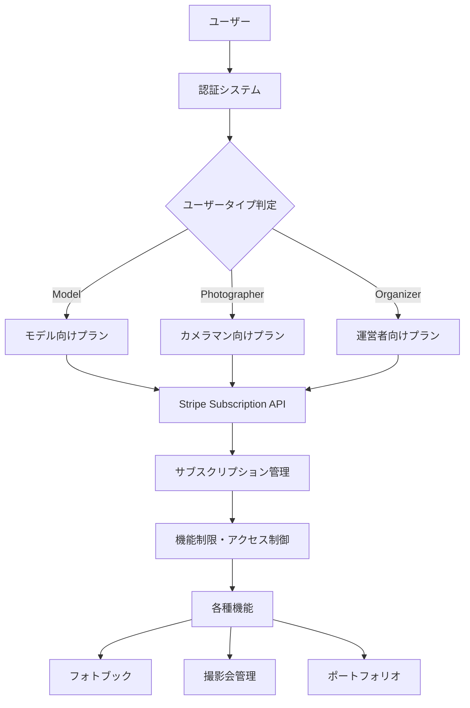

# ShutterHub サブスクリプションシステム

> **ユーザータイプ別サブスクリプション機能の要件定義・設計ドキュメント**

## 📋 ドキュメント構成

### 📚 要件・設計
- [**requirements.md**](./requirements.md) - 全体要件定義
- [**database-design.md**](./database-design.md) - データベース設計
- [**api-specification.md**](./api-specification.md) - API仕様
- [**stripe-integration.md**](./stripe-integration.md) - Stripe連携詳細

### 👥 ユーザータイプ別プラン
- [**user-type-plans/model-plans.md**](./user-type-plans/model-plans.md) - モデル向けプラン
- [**user-type-plans/photographer-plans.md**](./user-type-plans/photographer-plans.md) - カメラマン向けプラン
- [**user-type-plans/organizer-plans.md**](./user-type-plans/organizer-plans.md) - 運営者向けプラン

### 🚀 実装・移行
- [**implementation-phases.md**](./implementation-phases.md) - 実装フェーズ計画
- [**migration-plan.md**](./migration-plan.md) - 既存ユーザー移行計画

## 🎯 システム概要

ShutterHubのサブスクリプションシステムは、3つのユーザータイプ（モデル・カメラマン・運営者）それぞれに最適化されたプランを提供します。

### 🎨 設計方針

#### **ユーザータイプ別最適化**
- 各ユーザータイプの特有ニーズに対応
- 明確な価値提案と機能境界
- 将来的な拡張性を考慮

#### **ハイブリッドアプローチ**
- 共通基盤機能 + ユーザータイプ特化機能
- 統一されたStripe連携基盤
- 柔軟なプラン変更・ユーザータイプ変更対応

## 🏗️ アーキテクチャ概要

## 💰 プラン構成概要

### 📸 モデル向けプラン
- **Free**: 基本機能（フォトブック2冊）
- **Basic**: 月額680円（フォトブック10冊、優先予約チケット）
- **Premium**: 月額1,280円（無制限、プレミアムバッジ）

### 📷 カメラマン向けプラン
- **Free**: 基本機能（フォトブック3冊）
- **Pro**: 月額980円（クライアント管理、透かし除去）
- **Business**: 月額1,980円（商用ライセンス、ブランディング）

### 🎬 運営者向けプラン
- **Free**: 基本機能（撮影会3件）
- **Standard**: 月額1,480円（分析機能、CRM）
- **Professional**: 月額2,980円（マーケティングツール、API）

## 🚀 実装スケジュール

| Phase | 期間 | 内容 |
|-------|------|------|
| **Phase 1** | 1.5週間 | データベース基盤構築 |
| **Phase 2** | 1週間 | Stripe連携強化 |
| **Phase 3** | 1.5週間 | UI実装 |
| **Phase 4** | 1週間 | 機能制限実装 |

**総工数**: 約5週間

## 📊 期待される効果

### 💵 収益化
- **月額課金収入**: 安定した収益基盤
- **ユーザータイプ別最適化**: 支払い意欲に応じた価格設定
- **アップセル機会**: 機能拡張による収益向上

### 👥 ユーザー体験
- **明確な価値提案**: 各ユーザータイプに特化した機能
- **段階的成長**: フリー→有料への自然な移行
- **専門性重視**: プロフェッショナルユーザーへの高付加価値提供

## ⚠️ 重要な考慮事項

1. **既存ユーザー移行**: 現在の無料ユーザーの適切なプラン移行
2. **ユーザータイプ変更**: モデル→カメラマン等の変更時の処理
3. **機能制限バランス**: ユーザー離脱を防ぐ適切な制限レベル
4. **競合価格調査**: 市場価格との整合性確認

## 📞 問い合わせ・フィードバック

このドキュメントに関する質問や改善提案は、開発チームまでお知らせください。

---

**最終更新**: 2025-01-18  
**バージョン**: 1.0  
**ステータス**: 要件定義完了・実装準備中
