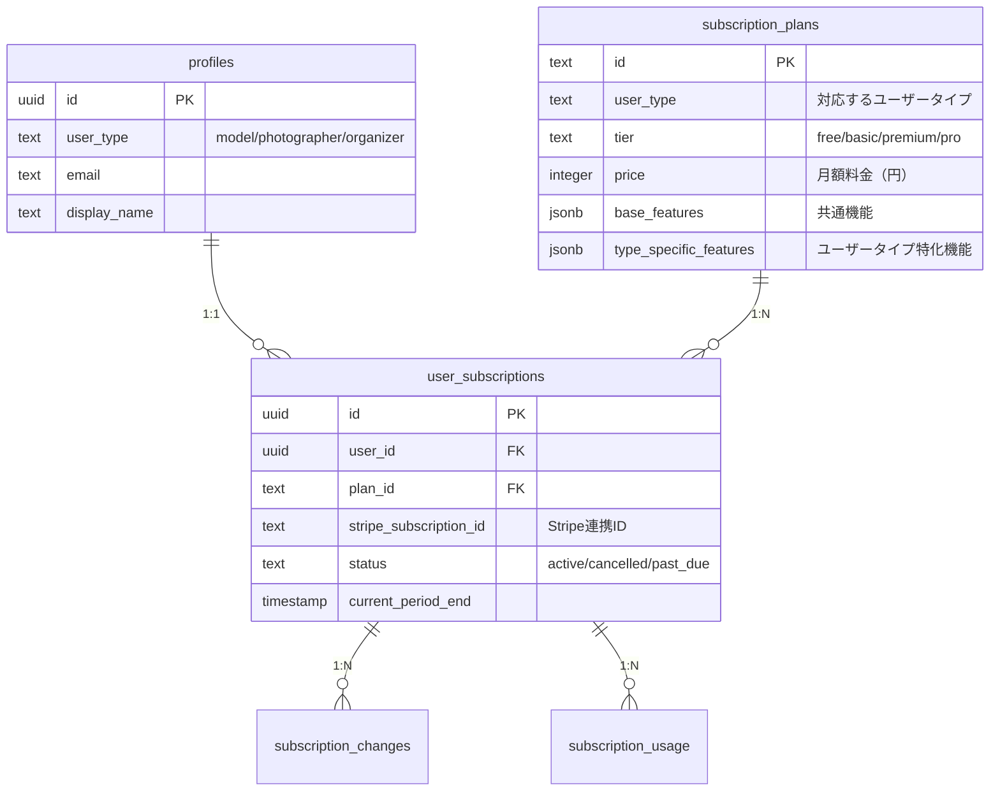

# サブスクリプションシステム データベース設計

> **ユーザータイプ別サブスクリプション機能のデータベース設計詳細**

## 📋 設計概要

### 設計方針
- **ユーザータイプ別最適化**: 各user_type（model/photographer/organizer）に特化したプラン管理
- **既存システム統合**: 現在のprofiles.user_typeとの完全な互換性
- **Stripe連携**: Stripe Subscription APIとの完全同期
- **拡張性**: 将来的な新機能・新ユーザータイプへの対応

### アーキテクチャパターン


## 🗄️ テーブル設計詳細

### 1. subscription_plans テーブル

#### 基本構造
```sql
CREATE TABLE subscription_plans (
  id TEXT PRIMARY KEY, -- 例: 'model_basic', 'photographer_pro'
  name TEXT NOT NULL, -- 例: 'モデル ベーシックプラン'
  user_type user_type NOT NULL, -- 'model', 'photographer', 'organizer'
  tier TEXT NOT NULL, -- 'free', 'basic', 'premium', 'pro', 'business', 'professional'
  price INTEGER NOT NULL, -- 月額料金（円）
  stripe_price_id TEXT, -- Stripe Price ID（freeプランはNULL）
  base_features JSONB NOT NULL, -- 共通機能設定
  type_specific_features JSONB NOT NULL, -- ユーザータイプ特化機能
  is_active BOOLEAN DEFAULT TRUE, -- プランの有効性
  display_order INTEGER DEFAULT 0, -- 表示順序
  description TEXT, -- プラン説明
  created_at TIMESTAMP WITH TIME ZONE DEFAULT NOW(),
  updated_at TIMESTAMP WITH TIME ZONE DEFAULT NOW(),
  
  -- 制約
  UNIQUE(user_type, tier),
  CHECK (price >= 0),
  CHECK (tier IN ('free', 'basic', 'premium', 'pro', 'business', 'professional'))
);
```

#### 機能設定のJSONB構造

##### **base_features（共通機能）**
```json
{
  "photobookLimit": 10,
  "premiumTemplates": true,
  "exportQuality": "high",
  "prioritySupport": false,
  "storageLimit": 5000,
  "apiAccess": false
}
```

##### **type_specific_features（ユーザータイプ特化機能）**

**モデル向け機能**
```json
{
  "portfolioLimit": 50,
  "priorityBookingTickets": 2,
  "reviewAnalytics": true,
  "profileBoost": true,
  "premiumBadge": false,
  "privateGallery": true
}
```

**カメラマン向け機能**
```json
{
  "clientManagement": true,
  "advancedPortfolio": true,
  "commercialLicense": false,
  "watermarkRemoval": true,
  "brandingCustomization": false,
  "highResDownload": true
}
```

**運営者向け機能**
```json
{
  "sessionLimit": 20,
  "advancedAnalytics": true,
  "marketingTools": false,
  "participantCRM": true,
  "revenueReports": true,
  "customBranding": false,
  "apiAccess": false
}
```

### 2. user_subscriptions テーブル

#### 基本構造
```sql
CREATE TABLE user_subscriptions (
  id UUID DEFAULT gen_random_uuid() PRIMARY KEY,
  user_id UUID REFERENCES profiles(id) ON DELETE CASCADE NOT NULL,
  plan_id TEXT REFERENCES subscription_plans(id) NOT NULL,
  
  -- Stripe連携情報
  stripe_subscription_id TEXT UNIQUE, -- Stripe Subscription ID
  stripe_customer_id TEXT, -- Stripe Customer ID
  stripe_payment_method_id TEXT, -- デフォルト支払い方法
  
  -- サブスクリプション状態
  status TEXT DEFAULT 'active' NOT NULL,
  trial_end_date TIMESTAMP WITH TIME ZONE,
  current_period_start TIMESTAMP WITH TIME ZONE,
  current_period_end TIMESTAMP WITH TIME ZONE,
  cancel_at_period_end BOOLEAN DEFAULT FALSE,
  cancelled_at TIMESTAMP WITH TIME ZONE,
  
  -- メタデータ
  metadata JSONB DEFAULT '{}',
  created_at TIMESTAMP WITH TIME ZONE DEFAULT NOW(),
  updated_at TIMESTAMP WITH TIME ZONE DEFAULT NOW(),
  
  -- 制約
  UNIQUE(user_id), -- 1ユーザー1サブスクリプション
  CHECK (status IN ('active', 'cancelled', 'past_due', 'unpaid', 'trialing', 'incomplete'))
);
```

#### インデックス設定
```sql
-- パフォーマンス最適化用インデックス
CREATE INDEX idx_user_subscriptions_user_id ON user_subscriptions(user_id);
CREATE INDEX idx_user_subscriptions_plan_id ON user_subscriptions(plan_id);
CREATE INDEX idx_user_subscriptions_stripe_id ON user_subscriptions(stripe_subscription_id);
CREATE INDEX idx_user_subscriptions_status ON user_subscriptions(status);
CREATE INDEX idx_user_subscriptions_period_end ON user_subscriptions(current_period_end);
```

### 3. subscription_changes テーブル（履歴管理）

```sql
CREATE TABLE subscription_changes (
  id UUID DEFAULT gen_random_uuid() PRIMARY KEY,
  user_id UUID REFERENCES profiles(id) ON DELETE CASCADE NOT NULL,
  subscription_id UUID REFERENCES user_subscriptions(id) ON DELETE CASCADE NOT NULL,
  
  -- 変更内容
  change_type TEXT NOT NULL, -- 'upgrade', 'downgrade', 'cancel', 'reactivate', 'user_type_change'
  from_plan_id TEXT REFERENCES subscription_plans(id),
  to_plan_id TEXT REFERENCES subscription_plans(id),
  
  -- 変更理由・詳細
  change_reason TEXT,
  effective_date TIMESTAMP WITH TIME ZONE DEFAULT NOW(),
  proration_amount INTEGER, -- 日割り計算額（円）
  
  -- Stripe関連
  stripe_invoice_id TEXT,
  stripe_proration_date TIMESTAMP WITH TIME ZONE,
  
  -- メタデータ
  metadata JSONB DEFAULT '{}',
  created_at TIMESTAMP WITH TIME ZONE DEFAULT NOW(),
  
  -- 制約
  CHECK (change_type IN ('upgrade', 'downgrade', 'cancel', 'reactivate', 'user_type_change', 'plan_switch'))
);
```

### 4. subscription_usage テーブル（使用量追跡）

```sql
CREATE TABLE subscription_usage (
  id UUID DEFAULT gen_random_uuid() PRIMARY KEY,
  user_id UUID REFERENCES profiles(id) ON DELETE CASCADE NOT NULL,
  subscription_id UUID REFERENCES user_subscriptions(id) ON DELETE CASCADE NOT NULL,
  
  -- 使用量データ
  period_start TIMESTAMP WITH TIME ZONE NOT NULL,
  period_end TIMESTAMP WITH TIME ZONE NOT NULL,
  usage_data JSONB NOT NULL, -- 使用量の詳細データ
  
  -- 制限チェック用
  limits_data JSONB NOT NULL, -- その期間の制限値
  
  created_at TIMESTAMP WITH TIME ZONE DEFAULT NOW(),
  updated_at TIMESTAMP WITH TIME ZONE DEFAULT NOW(),
  
  -- 制約
  UNIQUE(user_id, period_start, period_end)
);
```

#### usage_dataの構造例
```json
{
  "photobooks_created": 5,
  "premium_templates_used": 12,
  "storage_used_mb": 2048,
  "api_requests": 150,
  "priority_bookings_used": 2,
  "client_projects_created": 3,
  "marketing_campaigns_sent": 1
}
```

### 5. subscription_invoices テーブル（請求履歴）

```sql
CREATE TABLE subscription_invoices (
  id UUID DEFAULT gen_random_uuid() PRIMARY KEY,
  user_id UUID REFERENCES profiles(id) ON DELETE CASCADE NOT NULL,
  subscription_id UUID REFERENCES user_subscriptions(id) ON DELETE CASCADE NOT NULL,
  
  -- Stripe連携
  stripe_invoice_id TEXT UNIQUE NOT NULL,
  stripe_payment_intent_id TEXT,
  
  -- 請求情報
  amount_total INTEGER NOT NULL, -- 総額（円）
  amount_paid INTEGER NOT NULL, -- 支払い済み額（円）
  amount_due INTEGER NOT NULL, -- 未払い額（円）
  currency TEXT DEFAULT 'jpy',
  
  -- 請求状態
  status TEXT NOT NULL, -- 'draft', 'open', 'paid', 'void', 'uncollectible'
  
  -- 請求期間
  period_start TIMESTAMP WITH TIME ZONE NOT NULL,
  period_end TIMESTAMP WITH TIME ZONE NOT NULL,
  
  -- 日付情報
  invoice_date TIMESTAMP WITH TIME ZONE NOT NULL,
  due_date TIMESTAMP WITH TIME ZONE,
  paid_at TIMESTAMP WITH TIME ZONE,
  
  -- 請求明細（JSON）
  line_items JSONB NOT NULL,
  
  created_at TIMESTAMP WITH TIME ZONE DEFAULT NOW(),
  updated_at TIMESTAMP WITH TIME ZONE DEFAULT NOW(),
  
  -- 制約
  CHECK (status IN ('draft', 'open', 'paid', 'void', 'uncollectible')),
  CHECK (amount_total >= 0),
  CHECK (amount_paid >= 0),
  CHECK (amount_due >= 0)
);
```

## 🔧 初期データ設定

### プラン定義データ

#### モデル向けプラン
```sql
INSERT INTO subscription_plans (id, name, user_type, tier, price, stripe_price_id, base_features, type_specific_features) VALUES
('model_free', 'モデル フリープラン', 'model', 'free', 0, NULL, 
 '{"photobookLimit": 2, "premiumTemplates": false, "exportQuality": "standard", "prioritySupport": false, "storageLimit": 1000}',
 '{"portfolioLimit": 10, "priorityBookingTickets": 0, "reviewAnalytics": false, "profileBoost": false, "premiumBadge": false}'),

('model_basic', 'モデル ベーシックプラン', 'model', 'basic', 680, 'price_model_basic_monthly',
 '{"photobookLimit": 10, "premiumTemplates": true, "exportQuality": "high", "prioritySupport": false, "storageLimit": 3000}',
 '{"portfolioLimit": 50, "priorityBookingTickets": 2, "reviewAnalytics": true, "profileBoost": true, "premiumBadge": false}'),

('model_premium', 'モデル プレミアムプラン', 'model', 'premium', 1280, 'price_model_premium_monthly',
 '{"photobookLimit": -1, "premiumTemplates": true, "exportQuality": "ultra", "prioritySupport": true, "storageLimit": 10000}',
 '{"portfolioLimit": -1, "priorityBookingTickets": 5, "reviewAnalytics": true, "profileBoost": true, "premiumBadge": true}');
```

#### カメラマン向けプラン
```sql
INSERT INTO subscription_plans (id, name, user_type, tier, price, stripe_price_id, base_features, type_specific_features) VALUES
('photographer_free', 'カメラマン フリープラン', 'photographer', 'free', 0, NULL,
 '{"photobookLimit": 3, "premiumTemplates": false, "exportQuality": "standard", "prioritySupport": false, "storageLimit": 1000}',
 '{"clientManagement": false, "advancedPortfolio": false, "commercialLicense": false, "watermarkRemoval": false, "brandingCustomization": false}'),

('photographer_pro', 'カメラマン プロプラン', 'photographer', 'pro', 980, 'price_photographer_pro_monthly',
 '{"photobookLimit": 20, "premiumTemplates": true, "exportQuality": "high", "prioritySupport": false, "storageLimit": 5000}',
 '{"clientManagement": true, "advancedPortfolio": true, "commercialLicense": false, "watermarkRemoval": true, "brandingCustomization": false}'),

('photographer_business', 'カメラマン ビジネスプラン', 'photographer', 'business', 1980, 'price_photographer_business_monthly',
 '{"photobookLimit": -1, "premiumTemplates": true, "exportQuality": "ultra", "prioritySupport": true, "storageLimit": 20000}',
 '{"clientManagement": true, "advancedPortfolio": true, "commercialLicense": true, "watermarkRemoval": true, "brandingCustomization": true}');
```

#### 運営者向けプラン
```sql
INSERT INTO subscription_plans (id, name, user_type, tier, price, stripe_price_id, base_features, type_specific_features) VALUES
('organizer_free', '運営者 フリープラン', 'organizer', 'free', 0, NULL,
 '{"photobookLimit": 3, "premiumTemplates": false, "exportQuality": "standard", "prioritySupport": false, "storageLimit": 1000}',
 '{"sessionLimit": 3, "advancedAnalytics": false, "marketingTools": false, "participantCRM": false, "revenueReports": false}'),

('organizer_standard', '運営者 スタンダードプラン', 'organizer', 'standard', 1480, 'price_organizer_standard_monthly',
 '{"photobookLimit": 15, "premiumTemplates": true, "exportQuality": "high", "prioritySupport": false, "storageLimit": 5000}',
 '{"sessionLimit": 20, "advancedAnalytics": true, "marketingTools": false, "participantCRM": true, "revenueReports": true}'),

('organizer_professional', '運営者 プロフェッショナルプラン', 'organizer', 'professional', 2980, 'price_organizer_professional_monthly',
 '{"photobookLimit": -1, "premiumTemplates": true, "exportQuality": "ultra", "prioritySupport": true, "storageLimit": 50000}',
 '{"sessionLimit": -1, "advancedAnalytics": true, "marketingTools": true, "participantCRM": true, "revenueReports": true, "customBranding": true, "apiAccess": true}');
```

## 🔒 RLS (Row Level Security) ポリシー

### user_subscriptions テーブル
```sql
-- RLS有効化
ALTER TABLE user_subscriptions ENABLE ROW LEVEL SECURITY;

-- ユーザーは自分のサブスクリプション情報のみ閲覧・更新可能
CREATE POLICY "Users can view own subscription" ON user_subscriptions
  FOR SELECT USING (auth.uid() = user_id);

CREATE POLICY "Users can update own subscription" ON user_subscriptions
  FOR UPDATE USING (auth.uid() = user_id);

-- 管理者は全てのサブスクリプション情報にアクセス可能
CREATE POLICY "Admins can manage all subscriptions" ON user_subscriptions
  FOR ALL USING (
    EXISTS (
      SELECT 1 FROM profiles 
      WHERE id = auth.uid() 
      AND user_type = 'admin'
    )
  );
```

### subscription_changes テーブル
```sql
ALTER TABLE subscription_changes ENABLE ROW LEVEL SECURITY;

-- 読み取り専用（ユーザーは自分の履歴のみ閲覧可能）
CREATE POLICY "Users can view own subscription changes" ON subscription_changes
  FOR SELECT USING (auth.uid() = user_id);

-- 管理者は全ての履歴にアクセス可能
CREATE POLICY "Admins can view all subscription changes" ON subscription_changes
  FOR ALL USING (
    EXISTS (
      SELECT 1 FROM profiles 
      WHERE id = auth.uid() 
      AND user_type = 'admin'
    )
  );
```

## 🔄 トリガー・関数

### 自動更新トリガー
```sql
-- updated_at自動更新関数
CREATE OR REPLACE FUNCTION update_updated_at_column()
RETURNS TRIGGER AS $$
BEGIN
  NEW.updated_at = NOW();
  RETURN NEW;
END;
$$ language 'plpgsql';

-- 各テーブルにトリガー設定
CREATE TRIGGER update_subscription_plans_updated_at 
  BEFORE UPDATE ON subscription_plans 
  FOR EACH ROW EXECUTE FUNCTION update_updated_at_column();

CREATE TRIGGER update_user_subscriptions_updated_at 
  BEFORE UPDATE ON user_subscriptions 
  FOR EACH ROW EXECUTE FUNCTION update_updated_at_column();

CREATE TRIGGER update_subscription_usage_updated_at 
  BEFORE UPDATE ON subscription_usage 
  FOR EACH ROW EXECUTE FUNCTION update_updated_at_column();
```

### サブスクリプション変更履歴記録関数
```sql
CREATE OR REPLACE FUNCTION record_subscription_change()
RETURNS TRIGGER AS $$
BEGIN
  -- プラン変更時のみ履歴記録
  IF OLD.plan_id != NEW.plan_id THEN
    INSERT INTO subscription_changes (
      user_id, subscription_id, change_type, 
      from_plan_id, to_plan_id, effective_date
    ) VALUES (
      NEW.user_id, NEW.id, 
      CASE 
        WHEN NEW.plan_id LIKE '%premium%' OR NEW.plan_id LIKE '%pro%' THEN 'upgrade'
        WHEN NEW.plan_id LIKE '%free%' THEN 'downgrade'
        ELSE 'plan_switch'
      END,
      OLD.plan_id, NEW.plan_id, NOW()
    );
  END IF;
  
  RETURN NEW;
END;
$$ language 'plpgsql';

CREATE TRIGGER track_subscription_changes
  AFTER UPDATE ON user_subscriptions
  FOR EACH ROW EXECUTE FUNCTION record_subscription_change();
```

## 📊 パフォーマンス最適化

### インデックス戦略
```sql
-- 複合インデックス（よく使われる組み合わせ）
CREATE INDEX idx_user_subscriptions_user_status ON user_subscriptions(user_id, status);
CREATE INDEX idx_subscription_plans_type_tier ON subscription_plans(user_type, tier);
CREATE INDEX idx_subscription_changes_user_date ON subscription_changes(user_id, effective_date DESC);

-- 部分インデックス（アクティブなサブスクリプションのみ）
CREATE INDEX idx_active_subscriptions ON user_subscriptions(user_id, plan_id) 
WHERE status = 'active';

-- JSONB用のGINインデックス
CREATE INDEX idx_subscription_plans_features ON subscription_plans USING GIN (base_features);
CREATE INDEX idx_subscription_plans_type_features ON subscription_plans USING GIN (type_specific_features);
```

### クエリ最適化例
```sql
-- ユーザーの現在のプラン情報取得（最適化済み）
CREATE OR REPLACE FUNCTION get_user_current_plan(user_uuid UUID)
RETURNS TABLE(
  plan_id TEXT,
  plan_name TEXT,
  user_type user_type,
  tier TEXT,
  features JSONB,
  status TEXT,
  period_end TIMESTAMP WITH TIME ZONE
) AS $$
BEGIN
  RETURN QUERY
  SELECT 
    sp.id,
    sp.name,
    sp.user_type,
    sp.tier,
    sp.base_features || sp.type_specific_features AS features,
    us.status,
    us.current_period_end
  FROM user_subscriptions us
  JOIN subscription_plans sp ON us.plan_id = sp.id
  WHERE us.user_id = user_uuid
    AND us.status = 'active'
  LIMIT 1;
END;
$$ LANGUAGE plpgsql;
```

## 🧪 テストデータ

### 開発用サンプルデータ
```sql
-- テスト用ユーザーのサブスクリプション設定
INSERT INTO user_subscriptions (user_id, plan_id, status, current_period_start, current_period_end) VALUES
-- モデルユーザー（ベーシックプラン）
('user-model-1-uuid', 'model_basic', 'active', NOW(), NOW() + INTERVAL '1 month'),
-- カメラマンユーザー（プロプラン）  
('user-photographer-1-uuid', 'photographer_pro', 'active', NOW(), NOW() + INTERVAL '1 month'),
-- 運営者ユーザー（スタンダードプラン）
('user-organizer-1-uuid', 'organizer_standard', 'active', NOW(), NOW() + INTERVAL '1 month');
```

---

**文書バージョン**: 1.0  
**最終更新**: 2025-01-18  
**データベース設計者**: 開発チーム  
**次回レビュー**: 実装開始前
