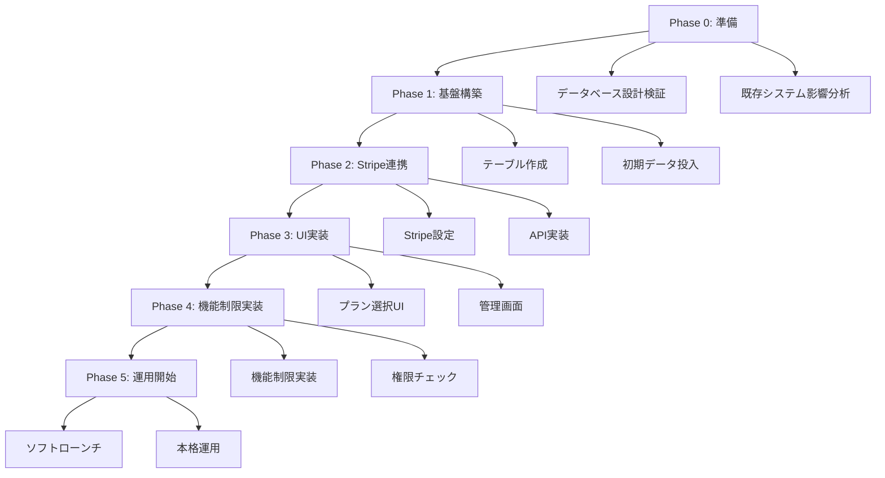

# サブスクリプションシステム実装フェーズ計画

> **段階的実装による安全で効率的なサブスクリプション機能の構築計画**

## 🎯 実装戦略

### 基本方針
- **段階的リリース**: リスクを最小化した段階的な機能リリース
- **既存システム保護**: 現在の機能に影響を与えない安全な実装
- **ユーザー体験重視**: 既存ユーザーの混乱を最小限に抑制
- **データ整合性**: 既存データとの完全な整合性確保

### 🚨 初回実装の重要方針

#### **基本仕組み優先アプローチ**
```yaml
Phase 1優先実装:
  - サブスクリプションテーブル基盤構築
  - Stripe基本連携（Customer/Subscription作成）
  - シンプルなプラン選択UI
  - 基本的な機能制限チェック（フォトブック数制限等）

Phase 2後回し実装:
  - ユーザータイプ別詳細機能（クライアント管理、高度分析等）
  - 複雑な制限ロジック（優先チケット、透かし除去等）
  - マーケティング機能
  - API アクセス・ブランディング機能

理由:
  - 基本的な課金システムの安定性確保を最優先
  - 複雑な機能実装によるリスク回避
  - 早期リリースによるユーザーフィードバック取得
```

#### **Stripe MCP連携方針**
```yaml
連携優先順位:
  1. MCP連携ツールを最優先で使用
  2. 連携不可の場合は実装を一時中断
  3. 手動でStripe接続確立後に再開
  4. npxコマンドは絶対に使用しない

中断判定条件:
  - mcp_stripe_test_connection が失敗
  - mcp_stripe_create_* 系ツールでエラー
  - MCP連携ツールが利用不可状態

再開手順:
  1. Stripe管理画面での手動確認
  2. API キーの再確認・更新
  3. MCP連携の再確立
  4. 接続テスト成功後に実装再開
```

### リスク軽減戦略


## 📅 Phase 0: 事前準備（1週間）

### 🎯 目標
既存システムへの影響を最小化し、安全な実装基盤を構築

### 📋 タスク詳細

#### **T0-1: データベース設計検証（2日）**
```yaml
担当者: データベースエンジニア
作業内容:
  - 既存テーブルとの整合性確認
  - パフォーマンス影響分析
  - インデックス設計最適化
  - RLSポリシー検証

成果物:
  - データベース設計レビュー報告書
  - パフォーマンステスト結果
  - 既存システム影響分析書

検証項目:
  - profiles テーブルとの関連性
  - user_type 列挙型との互換性
  - 既存クエリへの影響
  - データ移行戦略の妥当性
```

#### **T0-2: Stripe環境準備（1日）**
```yaml
担当者: バックエンドエンジニア
作業内容:
  - Stripe Test環境設定
  - Product/Price作成スクリプト準備
  - Webhook エンドポイント設計
  - 環境変数設定

成果物:
  - Stripe設定スクリプト
  - テスト用Price一覧
  - Webhook設計書
```

#### **T0-3: 既存機能影響分析（2日）**
```yaml
担当者: フロントエンド・バックエンドエンジニア
作業内容:
  - フォトブック機能の現在の制限実装確認
  - 権限チェック箇所の洗い出し
  - API変更による影響範囲特定

成果物:
  - 機能影響分析レポート
  - 変更必要箇所一覧
  - 後方互換性確保計画
```

### ✅ Phase 0 完了条件
- [ ] データベース設計が既存システムと完全に互換
- [ ] Stripe Test環境での基本動作確認完了
- [ ] 既存機能への影響が明確に把握されている
- [ ] 次フェーズの実装計画が詳細化されている

---

## 🏗️ Phase 1: データベース基盤構築（1.5週間）

### 🎯 目標
サブスクリプション管理に必要なデータベーススキーマを構築

### 📋 タスク詳細

#### **T1-1: マイグレーションファイル作成（2日）**
```sql
-- 実装予定のマイグレーション
-- 20250120000001_create_subscription_system.sql

-- サブスクリプションプランテーブル
CREATE TABLE subscription_plans (
  id TEXT PRIMARY KEY,
  name TEXT NOT NULL,
  user_type user_type NOT NULL,
  tier TEXT NOT NULL,
  price INTEGER NOT NULL,
  stripe_price_id TEXT,
  base_features JSONB NOT NULL,
  type_specific_features JSONB NOT NULL,
  is_active BOOLEAN DEFAULT TRUE,
  display_order INTEGER DEFAULT 0,
  description TEXT,
  created_at TIMESTAMP WITH TIME ZONE DEFAULT NOW(),
  updated_at TIMESTAMP WITH TIME ZONE DEFAULT NOW(),
  
  UNIQUE(user_type, tier),
  CHECK (price >= 0),
  CHECK (tier IN ('free', 'basic', 'premium', 'pro', 'business', 'professional'))
);

-- 以下、他のテーブルも同様に作成...
```

#### **T1-2: 初期データ投入（1日）**
```typescript
// 初期プランデータ作成スクリプト
const initialPlans = [
  // フリープラン（全ユーザータイプ）
  {
    id: 'model_free',
    name: 'モデル フリープラン',
    user_type: 'model',
    tier: 'free',
    price: 0,
    stripe_price_id: null,
    base_features: {
      photobookLimit: 2,
      premiumTemplates: false,
      exportQuality: 'standard'
    },
    type_specific_features: {
      portfolioLimit: 10,
      priorityBookingTickets: 0
    }
  },
  // 他のプランも同様...
];
```

#### **T1-3: RLSポリシー設定（1日）**
```sql
-- Row Level Security設定
ALTER TABLE user_subscriptions ENABLE ROW LEVEL SECURITY;

CREATE POLICY "Users can view own subscription" ON user_subscriptions
  FOR SELECT USING (auth.uid() = user_id);

CREATE POLICY "Users can update own subscription" ON user_subscriptions
  FOR UPDATE USING (auth.uid() = user_id);
```

#### **T1-4: 基本クエリ関数作成（2日）**
```sql
-- ユーザーの現在のプラン取得関数
CREATE OR REPLACE FUNCTION get_user_current_plan(user_uuid UUID)
RETURNS TABLE(
  plan_id TEXT,
  plan_name TEXT,
  user_type user_type,
  tier TEXT,
  features JSONB,
  status TEXT
) AS $$
BEGIN
  RETURN QUERY
  SELECT 
    sp.id,
    sp.name,
    sp.user_type,
    sp.tier,
    sp.base_features || sp.type_specific_features AS features,
    COALESCE(us.status, 'free') AS status
  FROM profiles p
  LEFT JOIN user_subscriptions us ON p.id = us.user_id AND us.status = 'active'
  LEFT JOIN subscription_plans sp ON us.plan_id = sp.id
  WHERE p.id = user_uuid;
END;
$$ LANGUAGE plpgsql;
```

### ✅ Phase 1 完了条件
- [ ] 全てのサブスクリプション関連テーブルが作成済み
- [ ] 初期プランデータが投入済み
- [ ] RLSポリシーが適切に設定済み
- [ ] 基本的なクエリ関数が動作確認済み
- [ ] 既存システムに影響がないことを確認済み

---

## 🔗 Phase 2: Stripe連携実装（1週間）

### 🎯 目標
Stripe APIとの連携機能を実装し、決済基盤を構築

### 📋 タスク詳細

#### **T2-1: Stripe Product/Price設定（1日）**
```typescript
// Stripe設定自動化スクリプト実行
await createStripeProducts();
await createStripePrices();
await configureWebhookEndpoints();
```

#### **T2-2: サブスクリプション管理API（3日）**
```typescript
// 主要API実装
export async function createSubscription(userId: string, planId: string) {
  // 1. プラン妥当性チェック
  // 2. Stripe Customer作成/取得
  // 3. Stripe Subscription作成
  // 4. データベース更新
  // 5. 結果返却
}

export async function updateSubscription(subscriptionId: string, newPlanId: string) {
  // プラン変更処理
}

export async function cancelSubscription(subscriptionId: string) {
  // キャンセル処理
}
```

#### **T2-3: Webhook処理実装（2日）**
```typescript
// Webhook イベント処理
const webhookHandlers = {
  'customer.subscription.created': handleSubscriptionCreated,
  'customer.subscription.updated': handleSubscriptionUpdated,
  'customer.subscription.deleted': handleSubscriptionDeleted,
  'invoice.paid': handleInvoicePaid,
  'invoice.payment_failed': handleInvoicePaymentFailed
};
```

#### **T2-4: エラーハンドリング・リトライ機能（1日）**
```typescript
// 堅牢なエラーハンドリング
class StripeErrorHandler {
  async handleWithRetry<T>(operation: () => Promise<T>, maxRetries = 3): Promise<T> {
    // 指数バックオフによるリトライ
  }
  
  handleStripeError(error: Stripe.StripeError): never {
    // Stripeエラーの適切な処理
  }
}
```

### ✅ Phase 2 完了条件
- [ ] Stripe Test環境での全機能動作確認済み
- [ ] Webhook処理が正常に動作することを確認済み
- [ ] エラーケースでの適切な処理を確認済み
- [ ] 冪等性が保証されていることを確認済み
- [ ] セキュリティ要件を満たしていることを確認済み

---

## 🎨 Phase 3: UI実装（1.5週間）

### 🎯 目標
ユーザーフレンドリーなサブスクリプション管理UIを実装

### 📋 タスク詳細

#### **T3-1: プラン比較・選択画面（3日）**
```typescript
// ユーザータイプ別プラン表示コンポーネント
export function PlanSelector({ userType }: { userType: UserType }) {
  const plans = usePlansForUserType(userType);
  const currentPlan = useCurrentPlan();
  
  return (
    <div className="grid grid-cols-1 md:grid-cols-3 gap-6">
      {plans.map(plan => (
        <PlanCard 
          key={plan.id}
          plan={plan}
          isCurrentPlan={currentPlan?.id === plan.id}
          onSelect={() => handlePlanSelect(plan.id)}
        />
      ))}
    </div>
  );
}
```

#### **T3-2: サブスクリプション管理画面（3日）**
```typescript
// 現在のプラン管理UI
export function SubscriptionManagement() {
  return (
    <div className="space-y-6">
      <CurrentPlanCard />
      <BillingHistory />
      <PaymentMethodManagement />
      <PlanChangeOptions />
      <CancellationOptions />
    </div>
  );
}
```

#### **T3-3: 決済フロー実装（3日）**
```typescript
// Stripe Elements使用の決済フォーム
export function PaymentForm({ planId }: { planId: string }) {
  const stripe = useStripe();
  const elements = useElements();
  
  const handleSubmit = async (event: FormEvent) => {
    // 決済処理
  };
  
  return (
    <form onSubmit={handleSubmit}>
      <CardElement />
      <button type="submit" disabled={!stripe}>
        サブスクリプション開始
      </button>
    </form>
  );
}
```

#### **T3-4: 管理者画面（2日）**
```typescript
// 管理者向けサブスクリプション管理
export function AdminSubscriptionDashboard() {
  return (
    <div className="grid grid-cols-1 lg:grid-cols-2 gap-6">
      <SubscriptionStats />
      <RevenueChart />
      <UserSubscriptionsList />
      <PlanManagement />
    </div>
  );
}
```

### ✅ Phase 3 完了条件
- [ ] 全ユーザータイプでプラン選択が正常動作
- [ ] 決済フローが問題なく完了する
- [ ] サブスクリプション管理機能が動作する
- [ ] 管理者画面で適切な情報が表示される
- [ ] レスポンシブデザインが適切に動作する

---

## ⚙️ Phase 4: 機能制限実装（1週間）

### 🎯 目標
プラン別の機能制限・アクセス制御を実装

### 📋 タスク詳細

#### **T4-1: 権限チェック基盤（2日）**
```typescript
// 統一された権限チェック機能
export function useSubscriptionFeatures() {
  const { currentPlan } = useSubscription();
  
  const checkFeatureAccess = useCallback((feature: string): boolean => {
    if (!currentPlan) return false;
    
    const features = {
      ...currentPlan.base_features,
      ...currentPlan.type_specific_features
    };
    
    return features[feature] === true;
  }, [currentPlan]);
  
  const checkLimit = useCallback((limitType: string, currentUsage: number): {
    allowed: boolean;
    remaining: number;
    limit: number;
  } => {
    const limit = currentPlan?.features[limitType] || 0;
    const unlimited = limit === -1;
    
    return {
      allowed: unlimited || currentUsage < limit,
      remaining: unlimited ? Infinity : Math.max(0, limit - currentUsage),
      limit: unlimited ? Infinity : limit
    };
  }, [currentPlan]);
  
  return { checkFeatureAccess, checkLimit };
}
```

#### **T4-2: フォトブック機能制限強化（2日）**
```typescript
// フォトブック作成時の制限チェック
export async function createPhotobook(userId: string, photobookData: PhotobookData) {
  const { checkLimit } = await getSubscriptionFeatures(userId);
  const currentCount = await getPhotobookCount(userId);
  
  const limitCheck = checkLimit('photobookLimit', currentCount);
  
  if (!limitCheck.allowed) {
    throw new Error(`フォトブック作成上限に達しています。現在のプラン: ${limitCheck.limit}冊`);
  }
  
  // フォトブック作成処理続行
}
```

#### **T4-3: ユーザータイプ別機能制限（2日）**
```typescript
// モデル向け機能制限
export function useModelFeatures() {
  const { checkFeatureAccess, checkLimit } = useSubscriptionFeatures();
  
  return {
    canUploadPortfolioPhoto: (currentCount: number) => 
      checkLimit('portfolioLimit', currentCount).allowed,
    
    canUsePriorityBooking: () => 
      checkFeatureAccess('priorityBookingTickets') && 
      getPriorityTicketCount() > 0,
    
    canAccessReviewAnalytics: () => 
      checkFeatureAccess('reviewAnalytics')
  };
}

// カメラマン向け機能制限
export function usePhotographerFeatures() {
  const { checkFeatureAccess } = useSubscriptionFeatures();
  
  return {
    canManageClients: () => checkFeatureAccess('clientManagement'),
    canRemoveWatermark: () => checkFeatureAccess('watermarkRemoval'),
    canAccessCommercialLicense: () => checkFeatureAccess('commercialLicense')
  };
}

// 運営者向け機能制限
export function useOrganizerFeatures() {
  const { checkFeatureAccess, checkLimit } = useSubscriptionFeatures();
  
  return {
    canCreateSession: (currentCount: number) => 
      checkLimit('sessionLimit', currentCount).allowed,
    
    canAccessAdvancedAnalytics: () => 
      checkFeatureAccess('advancedAnalytics'),
    
    canUseMarketingTools: () => 
      checkFeatureAccess('marketingTools')
  };
}
```

#### **T4-4: UI制限表示（1日）**
```typescript
// 制限に応じたUI表示
export function FeatureGate({ 
  feature, 
  children, 
  fallback 
}: {
  feature: string;
  children: React.ReactNode;
  fallback?: React.ReactNode;
}) {
  const { checkFeatureAccess } = useSubscriptionFeatures();
  const hasAccess = checkFeatureAccess(feature);
  
  if (hasAccess) {
    return <>{children}</>;
  }
  
  return fallback || <UpgradePrompt feature={feature} />;
}
```

### ✅ Phase 4 完了条件
- [x] 全ての機能で適切な制限チェックが動作
- [x] プラン変更時に制限が即座に反映される
- [x] 制限超過時に適切なエラーメッセージが表示
- [x] アップグレード促進UIが適切に表示される（FeatureGateコンポーネント実装済み）
- [x] 既存機能に影響がないことを確認済み

### ✅ Phase 4 実装完了状況（2025-11-06）

#### **実装完了項目**

1. **フォトブック制限チェック移行** ✅
   - `getPhotobookPlanLimits`関数をサブスクリプションプランベースに移行
   - `checkPhotobookCreationLimit`関数を`checkFeatureLimit`使用に修正
   - `createPhotobook`関数でプランIDを正しく設定

2. **ユーザータイプ別機能制限フック実装** ✅
   - `useModelFeatures`フック実装（`src/hooks/useModelFeatures.ts`）
   - `usePhotographerFeatures`フック実装（`src/hooks/usePhotographerFeatures.ts`）
   - `useOrganizerFeatures`フック実装（`src/hooks/useOrganizerFeatures.ts`）

3. **FeatureGateコンポーネント実装** ✅
   - 機能制限UI表示コンポーネント（`src/components/subscription/FeatureGate.tsx`）
   - 機能が利用可能な場合は子要素を表示
   - 利用不可能な場合はロック画面とアップグレードボタンを表示

#### **実装詳細**

**useModelFeatures フック**:
- ポートフォリオ制限（portfolioLimit）
- 優先予約チケット（priorityBookingTickets）
- 評価分析、プロフィール強化、プレミアムバッジ等の機能フラグ
- プレミアムテンプレート、高品質エクスポート等の共通機能

**usePhotographerFeatures フック**:
- クライアント管理、高度なポートフォリオ、商用ライセンス
- 透かし除去、ブランディングカスタマイズ
- プレミアムテンプレート、高品質エクスポート等の共通機能

**useOrganizerFeatures フック**:
- 撮影会作成数制限（sessionLimit）
- 高度な分析、マーケティングツール、参加者CRM
- 収益レポート、カスタムブランディング、APIアクセス

**FeatureGate コンポーネント**:
- 機能が利用可能な場合は子要素を表示
- 利用不可能な場合はロック画面とアップグレードボタンを表示
- カスタムメッセージ対応

---

## 🚀 Phase 5: 運用開始（1週間）

### 🎯 目標
本格運用に向けた最終調整と段階的リリース

### 📋 タスク詳細

#### **T5-1: ソフトローンチ（3日）**
```yaml
対象ユーザー: 
  - 開発チーム
  - 限定ベータユーザー（各ユーザータイプ5名ずつ）
  
検証項目:
  - 全プランでの正常な決済フロー
  - 機能制限の適切な動作
  - プラン変更・キャンセルの動作
  - Webhook処理の安定性
  
期間: 3日間
```

#### **T5-2: フィードバック対応（2日）**
```yaml
対応内容:
  - ベータユーザーからのフィードバック収集
  - 発見されたバグの修正
  - UI/UXの改善
  - ドキュメント更新
```

#### **T5-3: 本格運用開始（2日）**
```yaml
段階的リリース:
  Day 1: 運営者ユーザー向けリリース（最も収益性が高い）
  Day 2: カメラマンユーザー向けリリース
  Day 3: モデルユーザー向けリリース
  
監視項目:
  - 決済成功率
  - エラー発生率
  - ユーザー反応
  - システム負荷
```

### ✅ Phase 5 完了条件
- [ ] ソフトローンチで重大な問題が発見されていない
- [ ] 全ての発見された問題が修正済み
- [ ] 監視体制が整備されている
- [ ] サポート体制が準備されている
- [ ] 本格運用開始の準備が完了している

---

## 📊 品質保証・テスト戦略

### 🧪 テスト種別

#### **単体テスト**
```typescript
// 各Phase完了時に実行
describe('Subscription Management', () => {
  describe('Plan Creation', () => {
    it('should create subscription successfully');
    it('should handle payment failure gracefully');
    it('should validate plan compatibility with user type');
  });
  
  describe('Feature Access Control', () => {
    it('should allow access for paid features');
    it('should deny access for unpaid features');
    it('should handle plan changes immediately');
  });
});
```

#### **統合テスト**
```typescript
// Stripe連携の統合テスト
describe('Stripe Integration', () => {
  it('should create subscription end-to-end');
  it('should process webhook events correctly');
  it('should handle subscription updates');
  it('should process cancellations properly');
});
```

#### **E2Eテスト**
```typescript
// ユーザーフローの完全なテスト
test('Complete subscription flow', async ({ page }) => {
  await page.goto('/subscription/plans');
  await page.click('[data-testid="model-basic-plan"]');
  await page.fill('[data-testid="card-number"]', '4242424242424242');
  await page.click('[data-testid="subscribe-button"]');
  await expect(page.locator('[data-testid="success-message"]')).toBeVisible();
});
```

### 📈 監視・アラート

#### **重要メトリクス**
```yaml
ビジネスメトリクス:
  - 新規サブスクリプション数（日次）
  - チャーン率（月次）
  - MRR（月次経常収益）
  - ARPU（平均顧客単価）

技術メトリクス:
  - API応答時間
  - エラー率
  - Webhook処理成功率
  - データベースパフォーマンス

ユーザー体験メトリクス:
  - 決済完了率
  - プラン変更成功率
  - サポート問い合わせ数
```

#### **アラート設定**
```yaml
Critical:
  - 決済成功率 < 95%
  - Webhook処理失敗率 > 1%
  - API応答時間 > 3秒

Warning:
  - 新規登録数 < 前日比80%
  - エラー率 > 0.5%
  - サポート問い合わせ > 前日比150%
```

## 📋 リスク管理

### 🚨 高リスク項目

#### **技術的リスク**
```yaml
Stripe連携障害:
  確率: 中
  影響: 高
  対策: 
    - 複数の決済手段準備
    - 手動決済処理の準備
    - 障害時の自動通知

データ不整合:
  確率: 中
  影響: 高
  対策:
    - 定期的な整合性チェック
    - 自動修復機能
    - 手動修正手順の準備
```

#### **ビジネスリスク**
```yaml
ユーザー離脱:
  確率: 高
  影響: 中
  対策:
    - 段階的な制限導入
    - 既存ユーザー優遇措置
    - フィードバック収集・改善

競合対応:
  確率: 中
  影響: 中
  対策:
    - 価格競争力の継続的監視
    - 独自価値提案の強化
    - 顧客ロイヤルティ向上
```

### 🛡️ 緊急時対応

#### **ロールバック手順**
```yaml
Phase 4まで: 
  - 機能フラグによる即座無効化
  - データベース変更のロールバック
  - 既存システムへの完全復旧

Phase 5以降:
  - 段階的な機能無効化
  - 有料ユーザーへの事前通知
  - 代替手段の提供
```

---

**文書バージョン**: 1.0  
**最終更新**: 2025-01-18  
**総実装期間**: 約5週間  
**次回レビュー**: Phase 0開始前
