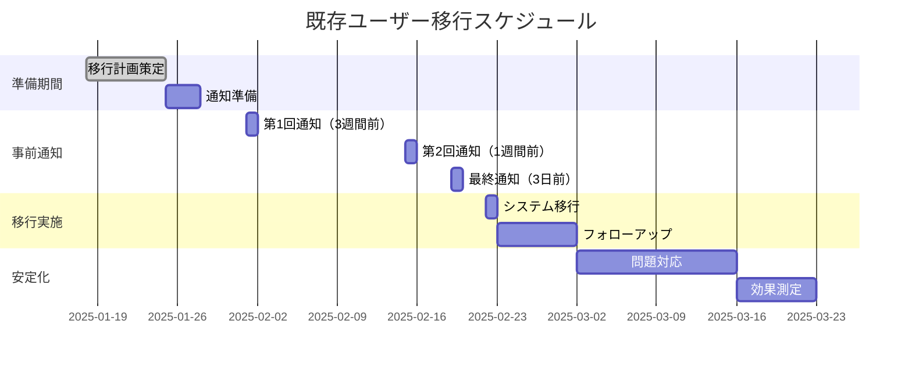

# 既存ユーザー移行計画

> **現在の無料ユーザーからサブスクリプションシステムへの安全で円滑な移行計画**

## 🎯 移行戦略概要

### 基本方針
- **ユーザー体験最優先**: 既存ユーザーの混乱・離脱を最小化
- **段階的移行**: 急激な変更を避け、段階的にサブスクリプションを導入
- **既存権利保護**: 現在利用中の機能は継続利用可能
- **透明性確保**: 変更内容を事前に明確に伝達

### 移行タイムライン


## 👥 現在のユーザー状況分析

### 既存ユーザー分布
```typescript
interface CurrentUserAnalysis {
  totalUsers: 1250; // 想定値
  userTypeDistribution: {
    model: 650;      // 52%
    photographer: 350; // 28%
    organizer: 250;   // 20%
  };
  
  activityLevel: {
    highlyActive: 200;  // 月10回以上利用
    active: 450;        // 月3-9回利用
    moderate: 400;      // 月1-2回利用
    inactive: 200;      // 3ヶ月以上未利用
  };
  
  featureUsage: {
    photobookUsers: 800;     // 64%
    portfolioUsers: 600;     // 48%
    sessionCreators: 180;    // 14%（運営者の72%）
    premiumFeatureUsers: 120; // 10%（現在のisPremium利用者）
  };
}
```

### リスク分析
```yaml
高離脱リスクユーザー:
  - 学生モデル（価格感度が高い）
  - 趣味カメラマン（ROI重視）
  - 小規模運営者（コスト意識が高い）
  
低離脱リスクユーザー:
  - プロモデル（ビジネス投資として認識）
  - 商用カメラマン（収益に直結）
  - 大規模運営者（効率化価値が高い）
```

## 🛡️ 既存ユーザー保護措置

### 1. グランドファザリング制度

#### **既存権利の完全保護**
```typescript
interface LegacyUserProtection {
  // 現在利用中の機能は永続的に利用可能
  grandfatheredFeatures: {
    photobookAccess: true;     // 現在のフォトブック利用権
    portfolioAccess: true;     // 現在のポートフォリオ利用権
    sessionCreation: true;     // 現在の撮影会作成権
    premiumTemplates: boolean; // 現在のプレミアムテンプレート利用状況
  };
  
  // 制限は新規利用分のみ適用
  newLimitations: {
    additionalPhotobooks: 'subscription_required';
    portfolioExpansion: 'subscription_required';
    advancedFeatures: 'subscription_required';
  };
}
```

#### **実装方法**
```sql
-- 既存ユーザーフラグ追加
ALTER TABLE profiles ADD COLUMN is_legacy_user BOOLEAN DEFAULT FALSE;
ALTER TABLE profiles ADD COLUMN legacy_features JSONB DEFAULT '{}';

-- 移行時に既存ユーザーをマーク
UPDATE profiles 
SET 
  is_legacy_user = TRUE,
  legacy_features = jsonb_build_object(
    'photobook_count_at_migration', (
      SELECT COUNT(*) FROM photobooks WHERE user_id = profiles.id
    ),
    'portfolio_count_at_migration', (
      SELECT COUNT(*) FROM portfolio_photos WHERE user_id = profiles.id
    ),
    'migration_date', NOW()
  )
WHERE created_at < '2025-02-22'::timestamp;
```

### 2. 段階的制限導入

#### **Phase 1: ソフト制限（移行後1ヶ月）**
```typescript
// 制限超過時の警告表示のみ
function checkSoftLimit(userId: string, feature: string): LimitCheckResult {
  const isLegacyUser = await checkLegacyUserStatus(userId);
  const currentUsage = await getCurrentUsage(userId, feature);
  const limit = await getFeatureLimit(userId, feature);
  
  if (isLegacyUser) {
    // 既存ユーザーは警告のみ、制限なし
    return {
      allowed: true,
      isWarning: currentUsage > limit,
      warningMessage: currentUsage > limit ? 
        `現在のご利用は無料枠を超過しています。今後の追加利用にはプラン契約が必要です。` : 
        null
    };
  }
  
  // 新規ユーザーは通常の制限適用
  return checkStandardLimit(userId, feature);
}
```

#### **Phase 2: 制限適用（移行後2ヶ月）**
```typescript
// 新規作成分のみ制限適用
function checkProgressiveLimit(userId: string, feature: string): LimitCheckResult {
  const legacyData = await getLegacyUserData(userId);
  const currentUsage = await getCurrentUsage(userId, feature);
  
  if (legacyData) {
    const legacyCount = legacyData.features[`${feature}_count_at_migration`] || 0;
    const newUsage = Math.max(0, currentUsage - legacyCount);
    const newUserLimit = await getFeatureLimit(userId, feature);
    
    return {
      allowed: newUsage < newUserLimit,
      remaining: Math.max(0, newUserLimit - newUsage),
      message: newUsage >= newUserLimit ? 
        `新規${feature}の作成にはプラン契約が必要です。既存の${legacyCount}件は引き続きご利用いただけます。` :
        null
    };
  }
  
  return checkStandardLimit(userId, feature);
}
```

## 📢 ユーザー通知戦略

### 1. 通知スケジュール

#### **第1回通知（3週間前）**
```yaml
タイミング: 2025年2月1日
対象: 全ユーザー
チャネル: メール + アプリ内通知
内容:
  - サブスクリプション機能導入のお知らせ
  - 既存機能は継続利用可能であることの明言
  - 新機能・改善内容の紹介
  - FAQ・詳細情報へのリンク
```

#### **第2回通知（1週間前）**
```yaml
タイミング: 2025年2月15日
対象: 全ユーザー（ユーザータイプ別カスタマイズ）
チャネル: メール + アプリ内通知 + プッシュ通知
内容:
  - 各ユーザータイプ向けのメリット詳細
  - 推奨プランの提案
  - 移行日程の再確認
  - 質問・サポート窓口の案内
```

#### **最終通知（3日前）**
```yaml
タイミング: 2025年2月19日
対象: 全ユーザー
チャネル: 全チャネル（メール + アプリ + プッシュ + SMS）
内容:
  - 最終確認とリマインダー
  - 移行当日の流れ説明
  - 緊急時サポート連絡先
  - 既存機能保護の再確認
```

### 2. 通知内容テンプレート

#### **メール通知例（モデルユーザー向け）**
```html
件名: 【重要】ShutterHub新機能のご案内 - あなたの撮影活動をさらにパワーアップ！

<モデル名>様

いつもShutterHubをご利用いただき、ありがとうございます。

この度、より充実した撮影体験を提供するため、新しいサブスクリプション機能を導入いたします。

■ あなたの既存機能は全て保護されます
現在ご利用中の全ての機能（フォトブック、ポートフォリオ等）は、
変更後も引き続き無料でご利用いただけます。

■ 新たに追加される機能
✨ 優先予約チケット - 人気撮影会への優先参加権
✨ 高品質テンプレート - プロ仕様のフォトブックテンプレート
✨ 詳細分析機能 - あなたの評価・成長を可視化

■ モデル様向け推奨プラン
【ベーシックプラン】月額680円
- 優先予約チケット 月2枚
- ポートフォリオ50枚まで拡張
- 詳細な評価分析機能

変更実施日: 2025年2月22日（土）

ご不明な点がございましたら、いつでもサポートまでお気軽にお問い合わせください。

ShutterHub運営チーム
```

## 🎁 移行インセンティブ

### 1. 早期契約特典

#### **先行契約ボーナス**
```yaml
対象期間: 移行日前1週間（2025年2月15日〜21日）
特典内容:
  - 初月料金50%オフ
  - 追加機能の無料体験期間延長
  - 限定テンプレートの無料提供
  - 優先サポートの提供

実装:
  早期契約フラグをユーザーに付与し、
  Stripe Couponを自動適用
```

#### **ロイヤルティボーナス**
```yaml
対象: 利用期間6ヶ月以上のユーザー
特典:
  - 永続的な5%割引
  - 限定バッジの付与
  - VIP機能への無料アクセス

実装:
  アカウント作成日に基づく自動判定
```

### 2. 段階的トライアル

#### **無料体験期間**
```typescript
interface TrialPeriod {
  duration: '30日間';
  targetUsers: '新規サブスクリプション契約者';
  includedFeatures: 'すべての有料機能';
  cancellationPolicy: '期間中いつでもキャンセル可能';
  autoRenewal: '体験期間終了24時間前に自動更新通知';
}
```

#### **段階的機能解放**
```yaml
Week 1: 基本的な有料機能の体験
Week 2: 高度な分析機能の体験  
Week 3: プレミアムテンプレートの体験
Week 4: 全機能フル体験 + 継続判断
```

## 📊 移行成功指標

### 1. 定量指標

#### **ユーザー離脱率**
```yaml
目標値: 
  - 全体離脱率 < 15%
  - 高活動ユーザー離脱率 < 5%
  - 有料転換ユーザー離脱率 < 2%

測定方法:
  移行前後30日間のアクティブユーザー数比較
```

#### **有料転換率**
```yaml
目標値:
  - 全体転換率 > 12%
  - モデルユーザー > 8%
  - カメラマンユーザー > 20%
  - 運営者ユーザー > 40%

測定期間: 移行後3ヶ月間
```

#### **顧客満足度**
```yaml
測定方法: 移行後アンケート調査
目標値:
  - 総合満足度 > 4.0/5.0
  - 移行プロセス満足度 > 4.2/5.0
  - 機能価値認識度 > 4.0/5.0
```

### 2. 定性指標

#### **フィードバック分析**
```yaml
収集方法:
  - アプリ内フィードバック機能
  - メール調査
  - ユーザーインタビュー（各タイプ5名）

分析項目:
  - 移行プロセスの分かりやすさ
  - 新機能の価値認識
  - 価格設定の適切性
  - 改善要望
```

## 🚨 緊急時対応計画

### 1. 大量離脱発生時

#### **トリガー条件**
- 移行後1週間で離脱率が20%を超過
- 1日あたりの離脱ユーザーが50名を超過
- ネガティブフィードバックが全体の30%を超過

#### **対応手順**
```yaml
即座実行:
  1. 移行プロセスの一時停止
  2. 緊急対策会議の開催
  3. ユーザーへの状況説明

24時間以内:
  4. 問題原因の特定・分析
  5. 対策案の策定・承認
  6. 修正版のリリース準備

48時間以内:
  7. 修正版のリリース
  8. 離脱ユーザーへの個別連絡
  9. 追加インセンティブの提供検討
```

### 2. 技術的問題発生時

#### **システム障害対応**
```yaml
Level 1 - 軽微な問題:
  - 一部機能の制限表示異常
  - 対応: 24時間以内の修正

Level 2 - 中程度の問題:
  - 決済処理の不具合
  - 対応: 12時間以内の修正 + ユーザー通知

Level 3 - 重大な問題:
  - 全機能アクセス不可
  - 対応: 即座のロールバック + 緊急メンテナンス
```

## 📈 移行後フォローアップ

### 1. 継続的サポート

#### **移行後1ヶ月間**
```yaml
サポート強化:
  - 専用サポート窓口の設置
  - チャットボットでのFAQ対応
  - 週1回の状況レポート作成

ユーザー教育:
  - 新機能活用ガイドの配信
  - ウェビナー・説明会の開催
  - ベストプラクティス事例の共有
```

#### **移行後3ヶ月間**
```yaml
効果測定:
  - 月次利用状況レポート
  - ユーザー満足度調査
  - 収益影響分析

改善実施:
  - フィードバックに基づく機能改善
  - UI/UX最適化
  - 価格設定の見直し検討
```

### 2. 長期的関係構築

#### **ロイヤルティプログラム**
```yaml
既存ユーザー特典:
  - 長期利用者向け特別割引
  - 限定イベントへの招待
  - 新機能の先行体験権

コミュニティ構築:
  - ユーザーアドバイザリーボード設置
  - フィードバック反映プロセスの透明化
  - 成功事例の積極的な紹介
```

---

**文書バージョン**: 1.0  
**最終更新**: 2025-01-18  
**移行実施予定日**: 2025年2月22日  
**次回レビュー**: 移行実施1週間前
