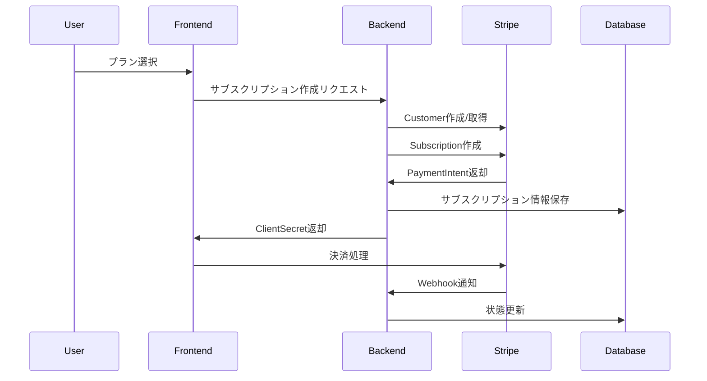

# Stripe連携仕様書

> **ShutterHub サブスクリプションシステムのStripe連携詳細仕様**

## 🎯 連携概要

### 連携方針
- **Stripe Subscription API**: 定期課金の管理
- **Stripe Customer API**: 顧客情報の管理
- **Stripe Price API**: ユーザータイプ別料金管理
- **Stripe Webhook**: リアルタイムイベント処理
- **Stripe Portal**: セルフサービス顧客ポータル

### アーキテクチャパターン


## 🗄️ Stripe リソース設計

### 1. Products & Prices 構成

#### **Product構成（ユーザータイプ別）**
```typescript
interface StripeProductConfig {
  model: {
    productId: 'prod_model_plans';
    name: 'ShutterHub モデルプラン';
    prices: {
      basic: 'price_model_basic_monthly';
      premium: 'price_model_premium_monthly';
    };
  };
  
  photographer: {
    productId: 'prod_photographer_plans';
    name: 'ShutterHub カメラマンプラン';
    prices: {
      pro: 'price_photographer_pro_monthly';
      business: 'price_photographer_business_monthly';
    };
  };
  
  organizer: {
    productId: 'prod_organizer_plans';
    name: 'ShutterHub 運営者プラン';
    prices: {
      standard: 'price_organizer_standard_monthly';
      professional: 'price_organizer_professional_monthly';
    };
  };
}
```

#### **Price作成スクリプト**
```typescript
// Stripe Price作成の自動化スクリプト
export async function createSubscriptionPrices() {
  const stripe = new Stripe(process.env.STRIPE_SECRET_KEY!);
  
  const priceConfigs = [
    // モデルプラン
    {
      product: 'prod_model_plans',
      unit_amount: 68000, // 680円 * 100
      currency: 'jpy',
      recurring: { interval: 'month' },
      nickname: 'Model Basic Monthly',
      metadata: { user_type: 'model', tier: 'basic' }
    },
    {
      product: 'prod_model_plans',
      unit_amount: 128000, // 1,280円 * 100
      currency: 'jpy',
      recurring: { interval: 'month' },
      nickname: 'Model Premium Monthly',
      metadata: { user_type: 'model', tier: 'premium' }
    },
    
    // カメラマンプラン
    {
      product: 'prod_photographer_plans',
      unit_amount: 98000, // 980円 * 100
      currency: 'jpy',
      recurring: { interval: 'month' },
      nickname: 'Photographer Pro Monthly',
      metadata: { user_type: 'photographer', tier: 'pro' }
    },
    {
      product: 'prod_photographer_plans',
      unit_amount: 198000, // 1,980円 * 100
      currency: 'jpy',
      recurring: { interval: 'month' },
      nickname: 'Photographer Business Monthly',
      metadata: { user_type: 'photographer', tier: 'business' }
    },
    
    // 運営者プラン
    {
      product: 'prod_organizer_plans',
      unit_amount: 148000, // 1,480円 * 100
      currency: 'jpy',
      recurring: { interval: 'month' },
      nickname: 'Organizer Standard Monthly',
      metadata: { user_type: 'organizer', tier: 'standard' }
    },
    {
      product: 'prod_organizer_plans',
      unit_amount: 298000, // 2,980円 * 100
      currency: 'jpy',
      recurring: { interval: 'month' },
      nickname: 'Organizer Professional Monthly',
      metadata: { user_type: 'organizer', tier: 'professional' }
    }
  ];
  
  for (const config of priceConfigs) {
    const price = await stripe.prices.create(config);
    console.log(`Created price: ${price.id} for ${config.nickname}`);
  }
}
```

### 2. Customer管理

#### **Customer作成・更新**
```typescript
export class StripeCustomerManager {
  private stripe: Stripe;
  
  constructor() {
    this.stripe = new Stripe(process.env.STRIPE_SECRET_KEY!);
  }
  
  async createOrUpdateCustomer(userId: string, userProfile: Profile): Promise<string> {
    // 既存Customer確認
    const existingCustomer = await this.findCustomerByUserId(userId);
    
    if (existingCustomer) {
      // 既存Customerの更新
      await this.stripe.customers.update(existingCustomer.id, {
        email: userProfile.email,
        name: userProfile.display_name || undefined,
        metadata: {
          user_id: userId,
          user_type: userProfile.user_type,
          updated_at: new Date().toISOString()
        }
      });
      return existingCustomer.id;
    } else {
      // 新規Customer作成
      const customer = await this.stripe.customers.create({
        email: userProfile.email,
        name: userProfile.display_name || undefined,
        metadata: {
          user_id: userId,
          user_type: userProfile.user_type,
          created_at: new Date().toISOString()
        }
      });
      return customer.id;
    }
  }
  
  private async findCustomerByUserId(userId: string): Promise<Stripe.Customer | null> {
    const customers = await this.stripe.customers.search({
      query: `metadata['user_id']:'${userId}'`,
      limit: 1
    });
    
    return customers.data.length > 0 ? customers.data[0] : null;
  }
}
```

### 3. Subscription管理

#### **サブスクリプション作成**
```typescript
export class StripeSubscriptionManager {
  private stripe: Stripe;
  
  constructor() {
    this.stripe = new Stripe(process.env.STRIPE_SECRET_KEY!);
  }
  
  async createSubscription(
    userId: string,
    planId: string,
    paymentMethodId?: string
  ): Promise<{
    subscriptionId: string;
    clientSecret?: string;
    status: string;
  }> {
    try {
      // プラン情報取得
      const plan = await this.getPlanDetails(planId);
      if (!plan.stripe_price_id) {
        throw new Error('Invalid plan: No Stripe price ID');
      }
      
      // Customer作成/取得
      const customerManager = new StripeCustomerManager();
      const userProfile = await this.getUserProfile(userId);
      const customerId = await customerManager.createOrUpdateCustomer(userId, userProfile);
      
      // Subscription作成
      const subscriptionParams: Stripe.SubscriptionCreateParams = {
        customer: customerId,
        items: [{ price: plan.stripe_price_id }],
        payment_behavior: 'default_incomplete',
        payment_settings: { save_default_payment_method: 'on_subscription' },
        expand: ['latest_invoice.payment_intent'],
        metadata: {
          user_id: userId,
          plan_id: planId,
          user_type: plan.user_type
        }
      };
      
      // 支払い方法が指定されている場合
      if (paymentMethodId) {
        subscriptionParams.default_payment_method = paymentMethodId;
      }
      
      const subscription = await this.stripe.subscriptions.create(subscriptionParams);
      
      // データベースに保存
      await this.saveSubscriptionToDatabase(subscription, userId, planId);
      
      const invoice = subscription.latest_invoice as Stripe.Invoice;
      const paymentIntent = invoice.payment_intent as Stripe.PaymentIntent;
      
      return {
        subscriptionId: subscription.id,
        clientSecret: paymentIntent?.client_secret,
        status: subscription.status
      };
      
    } catch (error) {
      console.error('Subscription creation failed:', error);
      throw error;
    }
  }
  
  async updateSubscription(
    subscriptionId: string,
    newPlanId: string
  ): Promise<Stripe.Subscription> {
    const newPlan = await this.getPlanDetails(newPlanId);
    
    const subscription = await this.stripe.subscriptions.retrieve(subscriptionId);
    
    return await this.stripe.subscriptions.update(subscriptionId, {
      items: [{
        id: subscription.items.data[0].id,
        price: newPlan.stripe_price_id
      }],
      proration_behavior: 'create_prorations',
      metadata: {
        ...subscription.metadata,
        plan_id: newPlanId,
        updated_at: new Date().toISOString()
      }
    });
  }
  
  async cancelSubscription(
    subscriptionId: string,
    cancelAtPeriodEnd: boolean = true
  ): Promise<Stripe.Subscription> {
    return await this.stripe.subscriptions.update(subscriptionId, {
      cancel_at_period_end: cancelAtPeriodEnd,
      metadata: {
        cancelled_at: new Date().toISOString(),
        cancel_at_period_end: cancelAtPeriodEnd.toString()
      }
    });
  }
}
```

## 🎣 Webhook処理

### 1. Webhook設定

#### **監視対象イベント**
```typescript
const WEBHOOK_EVENTS = [
  // サブスクリプション関連
  'customer.subscription.created',
  'customer.subscription.updated',
  'customer.subscription.deleted',
  
  // 請求関連
  'invoice.created',
  'invoice.finalized',
  'invoice.paid',
  'invoice.payment_failed',
  
  // 支払い関連
  'payment_intent.succeeded',
  'payment_intent.payment_failed',
  
  // 顧客関連
  'customer.created',
  'customer.updated',
  'customer.deleted'
];
```

#### **Webhook処理ハンドラー**
```typescript
export async function handleStripeWebhook(
  request: Request
): Promise<Response> {
  const signature = request.headers.get('stripe-signature')!;
  const body = await request.text();
  
  let event: Stripe.Event;
  
  try {
    event = stripe.webhooks.constructEvent(
      body,
      signature,
      process.env.STRIPE_WEBHOOK_SECRET!
    );
  } catch (error) {
    console.error('Webhook signature verification failed:', error);
    return new Response('Invalid signature', { status: 400 });
  }
  
  try {
    await processWebhookEvent(event);
    return new Response('OK', { status: 200 });
  } catch (error) {
    console.error('Webhook processing failed:', error);
    return new Response('Processing failed', { status: 500 });
  }
}

async function processWebhookEvent(event: Stripe.Event): Promise<void> {
  const handlers = {
    'customer.subscription.created': handleSubscriptionCreated,
    'customer.subscription.updated': handleSubscriptionUpdated,
    'customer.subscription.deleted': handleSubscriptionDeleted,
    'invoice.paid': handleInvoicePaid,
    'invoice.payment_failed': handleInvoicePaymentFailed,
    'payment_intent.succeeded': handlePaymentSucceeded,
    'payment_intent.payment_failed': handlePaymentFailed
  };
  
  const handler = handlers[event.type as keyof typeof handlers];
  
  if (handler) {
    await handler(event.data.object);
  } else {
    console.log(`Unhandled event type: ${event.type}`);
  }
}
```

### 2. イベント別処理

#### **サブスクリプション作成**
```typescript
async function handleSubscriptionCreated(subscription: Stripe.Subscription): Promise<void> {
  const userId = subscription.metadata.user_id;
  const planId = subscription.metadata.plan_id;
  
  if (!userId || !planId) {
    throw new Error('Missing required metadata in subscription');
  }
  
  // データベース更新
  await supabase
    .from('user_subscriptions')
    .upsert({
      user_id: userId,
      plan_id: planId,
      stripe_subscription_id: subscription.id,
      stripe_customer_id: subscription.customer as string,
      status: subscription.status,
      current_period_start: new Date(subscription.current_period_start * 1000).toISOString(),
      current_period_end: new Date(subscription.current_period_end * 1000).toISOString(),
      updated_at: new Date().toISOString()
    });
  
  // ウェルカムメール送信
  await sendWelcomeEmail(userId, planId);
}
```

#### **請求成功処理**
```typescript
async function handleInvoicePaid(invoice: Stripe.Invoice): Promise<void> {
  const subscriptionId = invoice.subscription as string;
  
  // サブスクリプション状態を'active'に更新
  await supabase
    .from('user_subscriptions')
    .update({
      status: 'active',
      updated_at: new Date().toISOString()
    })
    .eq('stripe_subscription_id', subscriptionId);
  
  // 請求履歴を保存
  await supabase
    .from('subscription_invoices')
    .insert({
      stripe_invoice_id: invoice.id,
      stripe_payment_intent_id: invoice.payment_intent as string,
      amount_total: invoice.amount_paid,
      amount_paid: invoice.amount_paid,
      amount_due: invoice.amount_due,
      status: invoice.status,
      period_start: new Date(invoice.period_start * 1000).toISOString(),
      period_end: new Date(invoice.period_end * 1000).toISOString(),
      invoice_date: new Date(invoice.created * 1000).toISOString(),
      paid_at: new Date().toISOString(),
      line_items: invoice.lines.data
    });
}
```

#### **支払い失敗処理**
```typescript
async function handleInvoicePaymentFailed(invoice: Stripe.Invoice): Promise<void> {
  const subscriptionId = invoice.subscription as string;
  
  // サブスクリプション状態を'past_due'に更新
  await supabase
    .from('user_subscriptions')
    .update({
      status: 'past_due',
      updated_at: new Date().toISOString()
    })
    .eq('stripe_subscription_id', subscriptionId);
  
  // ユーザーに支払い失敗通知
  const subscription = await supabase
    .from('user_subscriptions')
    .select('user_id')
    .eq('stripe_subscription_id', subscriptionId)
    .single();
    
  if (subscription.data) {
    await sendPaymentFailedNotification(subscription.data.user_id);
  }
}
```

## 🔒 セキュリティ対策

### 1. Webhook セキュリティ

#### **署名検証**
```typescript
function verifyWebhookSignature(
  payload: string,
  signature: string,
  secret: string
): boolean {
  try {
    stripe.webhooks.constructEvent(payload, signature, secret);
    return true;
  } catch (error) {
    console.error('Webhook signature verification failed:', error);
    return false;
  }
}
```

#### **冪等性保証**
```typescript
class WebhookProcessor {
  private processedEvents = new Set<string>();
  
  async processEvent(event: Stripe.Event): Promise<void> {
    // 重複処理防止
    if (this.processedEvents.has(event.id)) {
      console.log(`Event ${event.id} already processed`);
      return;
    }
    
    try {
      await this.handleEvent(event);
      this.processedEvents.add(event.id);
      
      // 処理済みイベントをデータベースに記録
      await this.recordProcessedEvent(event.id);
      
    } catch (error) {
      console.error(`Failed to process event ${event.id}:`, error);
      throw error;
    }
  }
}
```

### 2. API キー管理

#### **環境別設定**
```typescript
const stripeConfig = {
  development: {
    publishableKey: process.env.STRIPE_PUBLISHABLE_KEY_TEST!,
    secretKey: process.env.STRIPE_SECRET_KEY_TEST!,
    webhookSecret: process.env.STRIPE_WEBHOOK_SECRET_TEST!
  },
  production: {
    publishableKey: process.env.STRIPE_PUBLISHABLE_KEY_LIVE!,
    secretKey: process.env.STRIPE_SECRET_KEY_LIVE!,
    webhookSecret: process.env.STRIPE_WEBHOOK_SECRET_LIVE!
  }
};

const isProduction = process.env.NODE_ENV === 'production';
const config = isProduction ? stripeConfig.production : stripeConfig.development;
```

## 🧪 テスト戦略

### 1. 単体テスト

#### **サブスクリプション作成テスト**
```typescript
describe('StripeSubscriptionManager', () => {
  let manager: StripeSubscriptionManager;
  let mockStripe: jest.Mocked<Stripe>;
  
  beforeEach(() => {
    mockStripe = createMockStripe();
    manager = new StripeSubscriptionManager(mockStripe);
  });
  
  it('should create subscription successfully', async () => {
    const mockSubscription = createMockSubscription();
    mockStripe.subscriptions.create.mockResolvedValue(mockSubscription);
    
    const result = await manager.createSubscription('user123', 'model_basic');
    
    expect(result.subscriptionId).toBe(mockSubscription.id);
    expect(result.status).toBe('incomplete');
  });
  
  it('should handle subscription creation failure', async () => {
    mockStripe.subscriptions.create.mockRejectedValue(new Error('Card declined'));
    
    await expect(manager.createSubscription('user123', 'model_basic'))
      .rejects.toThrow('Card declined');
  });
});
```

### 2. 統合テスト

#### **Webhook処理テスト**
```typescript
describe('Webhook Integration', () => {
  it('should process subscription created webhook', async () => {
    const webhookEvent = createMockWebhookEvent('customer.subscription.created');
    
    const response = await handleStripeWebhook(
      createMockRequest(webhookEvent)
    );
    
    expect(response.status).toBe(200);
    
    // データベース更新確認
    const subscription = await supabase
      .from('user_subscriptions')
      .select('*')
      .eq('stripe_subscription_id', webhookEvent.data.object.id)
      .single();
      
    expect(subscription.data).toBeTruthy();
  });
});
```

## 📊 監視・ログ

### 1. ログ戦略

#### **構造化ログ**
```typescript
class StripeLogger {
  static logSubscriptionEvent(
    event: 'created' | 'updated' | 'cancelled',
    subscriptionId: string,
    userId: string,
    additionalData?: Record<string, any>
  ): void {
    logger.info('Stripe subscription event', {
      event,
      subscriptionId,
      userId,
      timestamp: new Date().toISOString(),
      ...additionalData
    });
  }
  
  static logWebhookEvent(
    eventType: string,
    eventId: string,
    processingTime: number,
    success: boolean,
    error?: Error
  ): void {
    logger.info('Stripe webhook processed', {
      eventType,
      eventId,
      processingTime,
      success,
      error: error?.message,
      timestamp: new Date().toISOString()
    });
  }
}
```

### 2. メトリクス監視

#### **重要指標**
```typescript
const STRIPE_METRICS = {
  // 成功率
  subscription_creation_success_rate: 'stripe.subscription.creation.success_rate',
  webhook_processing_success_rate: 'stripe.webhook.processing.success_rate',
  
  // 応答時間
  subscription_creation_duration: 'stripe.subscription.creation.duration',
  webhook_processing_duration: 'stripe.webhook.processing.duration',
  
  // エラー率
  payment_failure_rate: 'stripe.payment.failure_rate',
  subscription_cancellation_rate: 'stripe.subscription.cancellation_rate'
};
```

## 🔄 バックアップ・復旧

### 1. データ同期

#### **Stripe → Database 同期**
```typescript
export async function syncStripeSubscriptions(): Promise<void> {
  const stripe = new Stripe(process.env.STRIPE_SECRET_KEY!);
  
  // 全てのアクティブなサブスクリプションを取得
  const subscriptions = await stripe.subscriptions.list({
    status: 'active',
    limit: 100
  });
  
  for (const subscription of subscriptions.data) {
    const userId = subscription.metadata.user_id;
    if (!userId) continue;
    
    // データベースの情報と比較・更新
    await supabase
      .from('user_subscriptions')
      .upsert({
        user_id: userId,
        stripe_subscription_id: subscription.id,
        status: subscription.status,
        current_period_start: new Date(subscription.current_period_start * 1000).toISOString(),
        current_period_end: new Date(subscription.current_period_end * 1000).toISOString(),
        updated_at: new Date().toISOString()
      });
  }
}
```

---

**文書バージョン**: 1.0  
**最終更新**: 2025-01-18  
**Stripe API バージョン**: 2025-04-30.basil  
**次回レビュー**: 実装開始前
